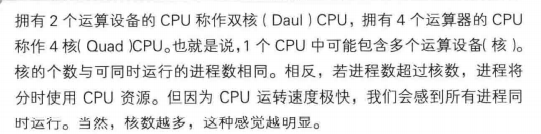
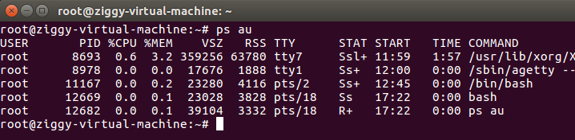
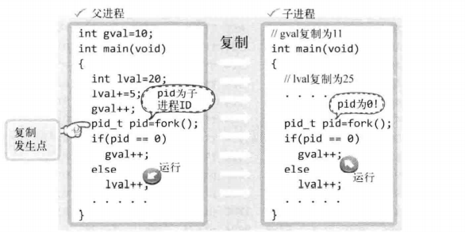
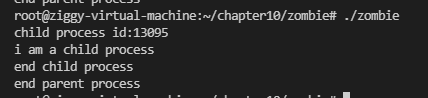

# 多进程服务端

## 进程概念及应用

改进服务器使其向所有发起请求的客户端提供服务，网络程序中数通信时间比CPU运算时间占比更大

(向多个客户端提供服务可以有效利用CPU)

并发服务端的实现方法（有代表性的三种）

- 多进程服务器：通过闯进啊多个进程提供服务
- 多路复用服务器：通过捆绑并统一管理I/O对象提供服务
- 多线程服务器：通过生成与客户端等量的线程提供服务

Windows不支持多进程服务器的实现

### 进程

**占用内存空间的正在运行**的程序

进程是程序流的基本单位



进程会从操作系统分配到进程ID，ID>=2

1分批给启动后的首个进程，用户进程无法分配到1

查看所有进程详细信息：



## 创建进程

```c++
//使用fork函数
#include<unistd.h>
pid_t fork(void);
//成功返回进程ID,失败返回-1
//fork函数复制正在运行的调用fork函数的进程，而且子进程和父进程都将执行fork函数调用后的语句
//子进程：fork函数返回0
//父进程：fork函数返回子进程ID
```



复制前父进程将两数都改变了，所以子进程复制的是改变状态下的数据

子进程将gval++，父进程将ival+++

```c++
//测试父子进程对数的改变
//fork.c
#include<stdio.h>
#include<unistd.h>

int gval = 10;

int main()
{
    pid_t pid;
    int val = 20;
    gval++; val++;
    pid = fork();
    if(pid==0){
        gval+=2;
        val+=2;
    }
    else{
        gval-=2;
        val-=2;
    }
    if(pid==0){
        printf("child [%d,%d]\n",gval,val);
    }
    else{
        printf("parent [%d,%d]\n",gval,val);
    }
    return 0;
}
```


父子进程拥有完全独立的内存结构

## 僵尸进程

进程在执行完工作后应该被销毁，但是有时这些进程会变为僵尸进程，继续占用系统资源

终止fork函数产生的子进程的方式：调用exit()，传递相应参数；main函数中执行return语句并返回值

产生原因：终止进程后，操作系统并不会立即销毁子进程，而是直到向exit传递的参数和return返回的值传递给该子进程的父进程

操作系统不会主动做这个操作，所以需要父进程主动发起函数调用，操作系统才会传递该值

父进程终止的同时，处在僵尸状态的子进程也会同时销毁

```c++
//创建僵尸进程:
//zombie.c
#include<stdio.h>
#include<unistd.h>

int main()
{
    pid_t pid = fork();
    if(pid==0){
        puts("i am a child process");
    }
    else{
        printf("child process id:%d\n",pid);
        sleep(30);//让父进程暂停30秒，防止父进程终止时将僵尸进程同时销毁

    }

    if(pid == 0){
        puts("end child process");
    }
    else{
        puts("end parent process");
    }

    return 0;
}
```

在父进程暂停的30秒内，查看僵尸进程（子进程已经return 0退出进程）



i

后台处理：不用打开新的终端


## 销毁僵尸进程的几种方法

### 1.wait函数

```c++
  #include <sys/types.h>
   #include <sys/wait.h>

   pid_t wait(int *status);
//成功则返回终止的子进程ID，失败返回-1
```
