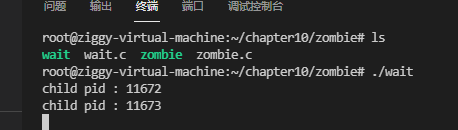
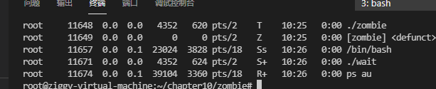
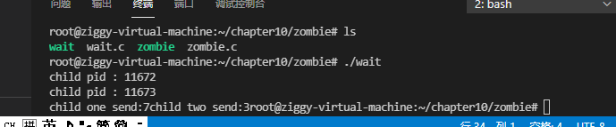
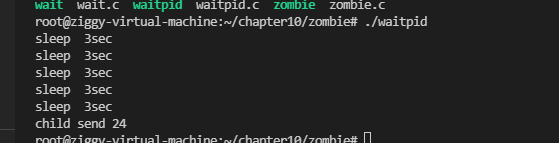

# 多进程服务端（一）

# 进程的概念和僵尸进程

## 进程概念及应用

改进服务器使其向所有发起请求的客户端提供服务，网络程序中数通信时间比CPU运算时间占比更大

(向多个客户端提供服务可以有效利用CPU)

并发服务端的实现方法（有代表性的三种）

- 多进程服务器：通过闯进啊多个进程提供服务
- 多路复用服务器：通过捆绑并统一管理I/O对象提供服务
- 多线程服务器：通过生成与客户端等量的线程提供服务

Windows不支持多进程服务器的实现

### 进程

**占用内存空间的正在运行**的程序

进程是程序流的基本单位


进程会从操作系统分配到进程ID，ID>=2

1分批给启动后的首个进程，用户进程无法分配到1

查看所有进程详细信息：


## 创建进程

```c++
//使用fork函数
#include<unistd.h>
pid_t fork(void);
//成功返回进程ID,失败返回-1
//fork函数复制正在运行的调用fork函数的进程，而且子进程和父进程都将执行fork函数调用后的语句
//子进程：fork函数返回0
//父进程：fork函数返回子进程ID
```


复制前父进程将两数都改变了，所以子进程复制的是改变状态下的数据

子进程将gval++，父进程将ival+++

```c++
//测试父子进程对数的改变
//fork.c
#include<stdio.h>
#include<unistd.h>

int gval = 10;

int main()
{
    pid_t pid;
    int val = 20;
    gval++; val++;
    pid = fork();
    if(pid==0){
        gval+=2;
        val+=2;
    }
    else{
        gval-=2;
        val-=2;
    }
    if(pid==0){
        printf("child [%d,%d]\n",gval,val);
    }
    else{
        printf("parent [%d,%d]\n",gval,val);
    }
    return 0;
}
```


父子进程拥有完全独立的内存结构

## 僵尸进程

进程在执行完工作后应该被销毁，但是有时这些进程会变为僵尸进程，继续占用系统资源

终止fork函数产生的子进程的方式：调用exit()，传递相应参数；main函数中执行return语句并返回值

产生原因：终止进程后，操作系统并不会立即销毁子进程，而是直到向exit传递的参数和return返回的值传递给该子进程的父进程

操作系统不会主动做这个操作，所以需要父进程主动发起函数调用，操作系统才会传递该值

父进程终止的同时，处在僵尸状态的子进程也会同时销毁

```c++
//创建僵尸进程:
//zombie.c
#include<stdio.h>
#include<unistd.h>

int main()
{
    pid_t pid = fork();
    if(pid==0){
        puts("i am a child process");
    }
    else{
        printf("child process id:%d\n",pid);
        sleep(30);//让父进程暂停30秒，防止父进程终止时将僵尸进程同时销毁

    }

    if(pid == 0){
        puts("end child process");
    }
    else{
        puts("end parent process");
    }

    return 0;
}
```

在父进程暂停的30秒内，查看僵尸进程（子进程已经return 0退出进程）


i

后台处理：不用打开新的终端


## 销毁僵尸进程的几种方法

### 1.wait函数

```c++
  #include <sys/types.h>
   #include <sys/wait.h>

   pid_t wait(int *status);
//成功则返回终止的子进程ID，失败返回-1
```

调用这个函数时如果有子进程终止，那么子进程终止时传递的返回值（exit函数的参数值，return返回值）将保存到该函数参数指向的内存空间中，但是参数指向的内存单元还有其他内容

通过宏进行分离

```c++
//WIFEXITED子进程正常终止时返回true
//WEXITSTATUS返回子进程的返回值
//例如：
  //向wait函数传递status地址后应写出：
   	if(WIFEXITED(status)){
        puts("Normal termination!");
        printf("child pass num:%d",WEXITSTATUS(status));
    }

//wait.c示例程序：
#include<stdio.h>
#include<stdlib.h>
#include<unistd.h>
#include<sys/wait.h>

int main(){

    int status;
    pid_t pid = fork();
    if(pid==0){
        //子进程
        return 3;
    }
    else{
        printf("child pid : %d\n",pid);//在父进程打印对应打印子进程的id
        pid = fork();
        if(pid==0){
            exit(7);

        }
        else{//此前创建了两个子进程
            printf("child pid : %d\n",pid);
            wait(&status);
            //向wait函数传递status地址后应写出：
            if(WIFEXITED(status)){              
                printf("child one send:%d",WEXITSTATUS(status));
            }
            wait(&status);//因为创建了两个进程所以要调用两次
            if(WIFEXITED(status)){              
                printf("child two send:%d",WEXITSTATUS(status));
            }
            sleep(30);
        }
    }
    return 0;
}
```








因为调用wait函数销毁了子进程，且终止时返回的值都传递到了父进程

所以ps au查看进程，没有对应子进程的PID

**调用wait函数时，如果没有已终止的子进程（返回值（exit或））则程序将阻塞到直到由子进程终止为止**

### 方法二：使用waitpid函数

```c++
#include<sys/socket.h>
pid_t waitpid(pid_t pid,int * statloc,int options);
//成功时返回终止的子进程ID（或0），失败返回-1
/*

pid：等待终止的目标子进程的ID，若传递-1则与wait相同，可以等待任意子进程终止
statloc：相当于wait中的status
options：传递头文件<sys/socket.h>声明的常量WNOHANG,即使没有终止的子进程也不会进入阻塞状态，而是返回0并退出函数

*/
```

```c++
//waitpid.c
#include<stdio.h>
#include<unistd.h>
#include<sys/socket.h>
#include<sys/wait.h>
int main()
{
    int status;
    pid_t pid = fork();
    if(pid==0){
        sleep(15);
        return 24;
    }
    else{//一直循环终止子进程，直到子进程sleep 15秒之后，返回值，终止子进程成功
        //没有子进程终止时将返回0（因为用了WNOHANG）
        while(!waitpid(-1,&status,WNOHANG)){
            sleep(3);
            puts("sleep  3sec");//验证不会阻塞
        }

    }
    if(WIFEXITED(status)){
        printf("child send %d\n",WEXITSTATUS(status));
    }
    return 0;
}
```




上图显示：子进程sleep 15秒，父进程在循环中每次sleep 3秒

且显示了waitpid函数没有阻塞

