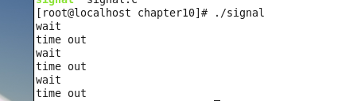
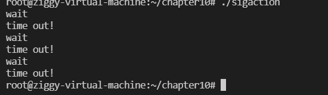
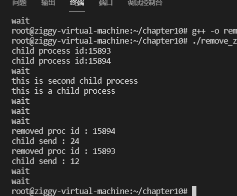
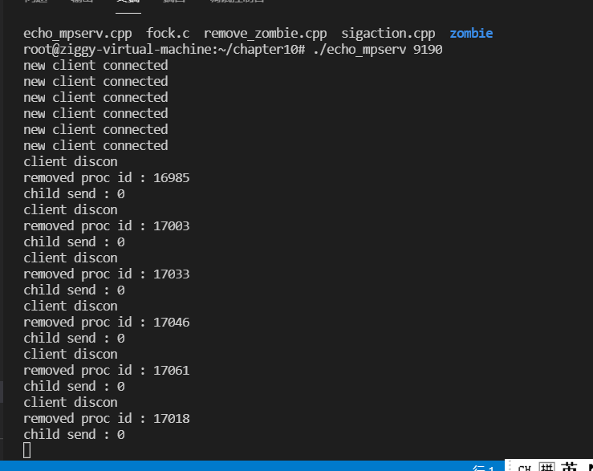
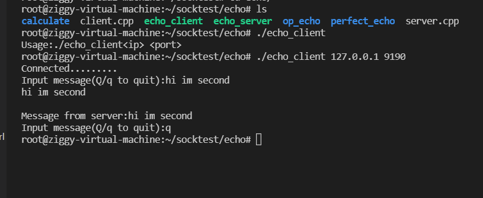
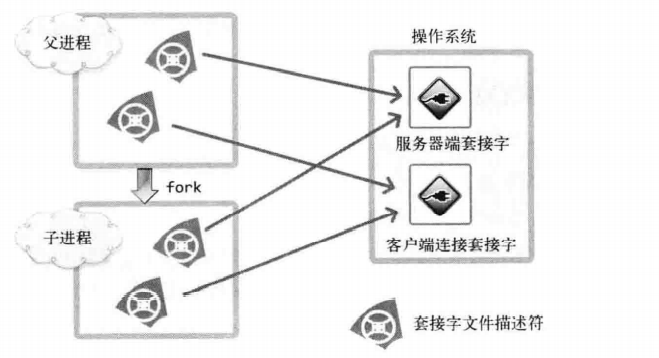
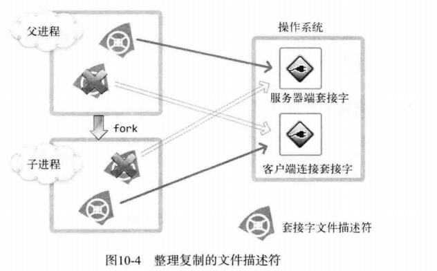
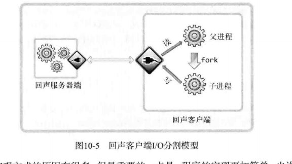
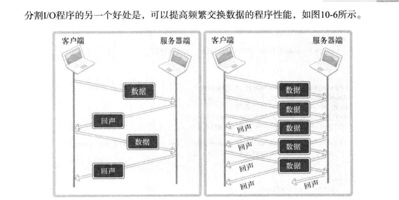

# 多进程服务器（二）

# 信号处理和

## 销毁进程带来的问题

子进程应该何时终止？

父进程大多数情况下不能只调用waitpid函数等待子进程终止

### 如何通知繁忙的父进程，他创建的子进程终止了？

子进程终止的识别主题是操作系统

为了通知父进程子进程终止的信息，**引入了信号处理机制**

## 信号和signal函数

信号是特定事件发生时由操作系统向进程发送的信息

为了响应该消息，执行与消息相关的自定义操作的过程叫做信号处理

进程发现自己的子进程结束时，请求操作系统调用特定函数：

```c++
//使用此函数来完成（又称为信号注册函数）
void *signal((int signo,void(*func)(int)))(int);
此函数的返回类型为函数指针
函数名： signal
参数：int signo，void(func)(int)
返回类型：参数为int，返回void型函数指针
    /*
    第一个参数为特殊情况信息，第二个参数为特殊情况下将要调用的函数的地址值
    发生第一个参数代表的情况时，调用第二个参数所指的函数
   
```

## 复习函数指针


在signal函数中注册的部分特殊情况对应的常数：

```c++
/*

SIGALRM  已到通过调用alarm函数注册的时间
SIGINT 输入CTRL+C
SIGCHLD 子进程终止

*/

//子进程终止则调用mychild函数：
signal(SIGCHLD,mychild);
//mychild函数的参数应为int ， 返回值应为void

//已到通过alarm函数注册的时间，请调用timeout函数
signal(SIGALRM,timeout);
//输入ctrl+c时调用keycontrol
signal(SIGINT,keycontrol);
```

以上是注册信号的过程

发生注册信号时，操作系统将调用该信号对应的函数

```c++
//alarm函数
#include<unistd.h>
unsigned int alarm(unsigned int seconds);
//如果调用该函数的同时向他传递一个正整型参数，则相应时间后将产生SIGALRM信号（以秒为单位）
//若传递0则之前对SIGALRM信号的预约将取消，如果通过该函数预约信号后未指定该信号对应的处理函数，则终止进程，不做任何处理
```


测试：

```c++
#include<stdio.h>
#include<unistd.h>
#include<signal.h>

void timeout(int sig){
    if(sig==SIGALRM){
        puts("time out");

    }
    alarm(2);
}

void keycontrol(int sig){
    if(sig==SIGINT)
        puts("ctrl+c pressed");
}

int main()
{
    int i;
    signal(SIGALRM,timeout);
    signal(SIGINT,keycontrol);
    alarm(2);
    for(int i = 0;i<3;i++){
        puts("wait");
        sleep(100);
    }

    return 0;
}
```



# 为什么会输出三次？？？

**以上程序的sleep(100)并没有这么长时间，这是因为进程处于sleep状态则无法调用函数，因此产生信号时，为了 调用信号处理器，将唤醒调用sleep而进入阻塞的进程，进程一旦被唤醒，则不会再次进入睡眠，即使未到达sleep中规定的时间**

### 使用sigaction代替signal

原因：signal函数在不同操作系统中可能会有区别

```c++
#include<signal.h>
int sigaction(int signo,const struct sigaction* act,struct sigaction* oldact);
//成功返回0，失败返回-1
/*

signo:与signal函数相同，传递信号信息
act:对应于第一个参数的信号处理函数信息
oldact:通过此参数获取之前注册的信号处理函数指针，不需要则传递0

*/

//sigaction结构体：
struct sigaction{
    void (*sa_handler)(int);
    sigset_t sa_mask;
    int sa_flags;
};

//第一个参数保存信号处理函数的指针值
  //  sa_mask,sa_flags在此处初始化为0,这两个成员用于指定信号相关的选项和特性
```


```c++
#include<stdio.h>
#include<unistd.h>
#include<signal.h>

void timeout(int sig){
    if(sig==SIGALRM){
        puts("time out");

    }
    alarm(2);

}

int main()
{
struct sigaction act;
//注册信号处理函数：
    act.sa_handler = timeout;
//        //使用函数将sa_mask的所有位初始化为0
            sigemptyset(&act.sa_mask);
                //初始化为0：
                    act.sa_flags = 0;

                        //注册SIGALRM信号的处理器，调用alarm函数预约两秒后发生信号

int i;
                        sigaction(SIGALRM,&act,0);
                                alarm(2);
                                    for(i = 0;i<3;i++){
                                            puts("wait");

                                               sleep(100);
                                    }
                                        return 0;                                                     }
}
```

**sigaction函数完全可以替代signal函数，它更加稳定**




### 使用信号处理技术消灭僵尸进程

子进程终止时会产生SIGCHLD信号

```c++
//使信号处理技术消灭僵尸进程

#include<stdio.h>
#include<unistd.h>
#include<sys/wait.h>
#include<signal.h>
#include<stdlib.h>

void read_childproc(int sig){
    int status;
    pid_t id = waitpid(-1,&status,WNOHANG);
    if(WIFEXITED(status)){
        printf("removed proc id : %d\n",id);
        printf("child send : %d\n",WEXITSTATUS(status));
    }
}

int main()
{
    pid_t pid;
    struct sigaction act;
    act.sa_handler = read_childproc;
    act.sa_flags = 0;
    sigemptyset(&act.sa_mask);
    sigaction(SIGCHLD,&act,0);
    //第一个子进程
    pid = fork();
    //子进程：
    if(pid==0){
        puts("this is a child process");
        sleep(10);
        return 12;
    }
    else{//父进程执行区域
        printf("child process id:%d\n",pid);//打印第一个子进程的pid
        pid = fork();//创建第二个子进程
        if(pid==0){
            puts("this is second child process");
            sleep(10);
            exit(24);

        }
        else{
            printf("child process id:%d\n",pid);//打印第一个子进程的pid
            for(int i = 0;i<5;i++){
                puts("wait");
                sleep(5);
//为了等待SIGCHLD信号，使父进程共暂停5次，发生信号时，父进程会被唤醒，所以
// 实际暂停时间不到25秒
            }
        }
    }
    return 0;

}
```



## 基于多任务的并发服务器

**使得之前的回声服务器可以为多个客户端提供服务，每当有客户端请求服务，服务端都创建一个子进程提供服务**

**基本操作：**

1. **回声服务端（父进程）调用accept函数受理客户端的连接请求**
2. **获取的socket文件描述符传递给子进程**
3. **子进程使用文件描述符提供服务**

***创建子进程时，子进程会复制父进程拥有的所有资源，所以无需手动传递文件描述符***

```c++
#include<iostream>
#include<sys/socket.h>
#include<arpa/inet.h>
#include<unistd.h>
#include<stdlib.h>
#include<stdio.h>
#include<arpa/inet.h>
#include<string.h>

#define BUF_SIZE 1024
void error_handling(char *message);

// connect()请求连接函数


int main(int argc,char* argv[]){
    int sock;
    sockaddr_in serv_addr;
    char message[30];
    int str_len;

    if(argc!=3){
        printf("Usage:%s<ip> <port>\n",argv[0]);
        exit(1);
    }

    sock = socket(PF_INET,SOCK_STREAM,0);
    if(sock==-1){
        error_handling("socket() error");
    }

    memset(&serv_addr,0,sizeof(serv_addr));
    serv_addr.sin_family = AF_INET;
    serv_addr.sin_addr.s_addr = inet_addr(argv[1]);
    serv_addr.sin_port = htons(atoi(argv[2]));

    if(connect(sock,(struct sockaddr*)&serv_addr,sizeof(serv_addr))==-1){
        error_handling("connect() error");
    }
    else
        puts("Connected.........");
    while (1)//实现echo，使用循环，直到用户输入q位置都一直收发信息
    {
        fputs("Input message(Q/q to quit):",stdout);
        fgets(message,BUF_SIZE,stdin);
        if(!strcmp(message,"q\n")||!strcmp(message,"Q\n")){
            break;
        }
        printf("%s\n",message);
        str_len = write(sock,message,strlen(message));
        // str_len = read(sock,message,BUF_SIZE-1);
        int recv_len = 0;
        int recv_cnt;
        while (recv_len<str_len)
        {
            recv_cnt = read(sock,&message[recv_len],BUF_SIZE-1);
            if(recv_cnt==-1)
                error_handling("read() error");
            recv_len+=recv_cnt;
             
        }
        
        message[str_len] = 0;

        printf("Message from server:%s\n",message);
    }
    
    // str_len = read(sock,message,sizeof(message)-1);
    // if(str_len==-1){
    //     error_handling("read() error!");
    // }

    // printf("Message from server: %s\n",message);
    close(sock);
    return 0;
}
void error_handling(char *message){
    fputs(message,stderr);
    fputc('\n',stderr);
    exit(1);
}
```










## 分割TCP的I/O程序

已经实现的回声服务器的缺点：
向服务器传输数据后，要等待接收完服务器端的所有回声数据后才能传输下一批数据

多个进程的情况下:


实行分割后，不同的进程分别负责输入和输出

父进程只需编写接收数据的代码，子进程只需发送数据



分割后，客户端发送数据时不需要考虑接收数据的情况，因此可以连续发送数据，提高同一时间内传输的数据量

```c++

```

