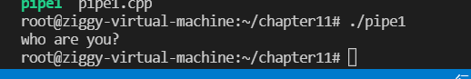
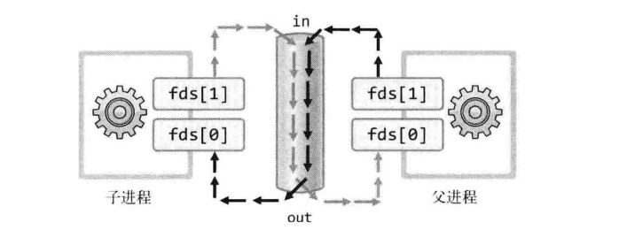

 

 

# 进程通信

## 使用管道实现进程间的通信

Fork函数创建的子进程不会与父进程共享内存空间，**进程具有完全独立的内存结构**

为了进程通信，需要创建管道，管道并不属于进程的资源，它是属于操作系统的，所以管道不是fork函数复制的对象

两个进程之间是通过操作系统提供的内存空间进行通信

```c++
在Ubuntu中使用man 命令查看pipe函数的定义：

      int pipe(int pipefd[2]);
       ends  of  the  pipe.  pipefd[0] refers to the read end of the pipe.  pipefd[1] refers to
       the write end of the pipe.  Data written to the write end of the pipe is buffered by the
       kernel  until  it  is  read  from  the  read  end of the pipe.  For further details, see
       pipe(7).

           pipefd[0]为通过管道接收数据时使用的的文件描述符（管道出口）
           pipefd[1]为通过管道传输数据时使用的的文件描述符（管道入口）
           
 // int pipe(int filedes[2]);
        
           父进程创建管道，可以对管道进行读写
           但是要与子进程进行数据交换，就需要将入口或出口的文件描述符传递给子进程（使用fork函数）
```

```c++
//子进程通过管道向父进程传递字符串
//（子进程向管道传递字符串，父进程从管道中读取字符串）
#include<stdio.h>
#include<unistd.h>

#define BUF_SIZE 30
int main()
{
    int fds[2];//用于存储用于I/O的文件描述符
    char str[] = "who are you?";
    char buf[BUF_SIZE];
    pid_t pid;
    pipe(fds);//创建管道，此时数组中有了描述符
    pid = fork();
    if(pid==0)
    {
        write(fds[1],str,sizeof(str));//fds[1]为通过管道传输数据的文件描述符（管道入口）
    }
    else{
        read(fds[0],buf,BUF_SIZE);
        puts(buf);
    }
    return 0;
    
}
```


​			

​						

## 通过管道实现进程间的双向通信



```c++
#include<stdio.h>
#include<unistd.h>

#define BUF_SIZE 30
int main()
{
    int fds[2];//用于存储用于I/O的文件描述符
    char str1[] = "Who are you?";
    char str2[] = "Thank you for your message";

    char buf[BUF_SIZE];
    pid_t pid;
    pipe(fds);//创建管道，此时数组中有了描述符
    pid = fork();
    if(pid==0)
    {
        write(fds[1],str1,sizeof(str1));//fds[1]为通过管道传输数据的文件描述符（管道入口）
        sleep(2);
        read(fds[0],buf,BUF_SIZE);
        printf("child proc output:%s\n",buf);
    }
    else{
        read(fds[0],buf,BUF_SIZE);
        printf("parent proc output:%s\n",buf);
        write(fds[1],str2,sizeof(str2));
        sleep(3);
        //如果注释掉18行，则在第19行的代码将读出17行写入的数据，管道中就没有了数据
        // 父进程的第一个read将无限期的等待管道中被写入数据
    }
    return 0;
    
}
```


**使用一个管道的双向通信需要我们预测，控制运行的流程，这在现实中是几乎不可能的**

**所以我们使用两个管道来进行双向通信**


```c++
#include<stdio.h>
#include<unistd.h>

#define BUF_SIZE 30
int main()
{
    int fds1[2];//用于存储用于I/O的文件描述符
    int fds2[2];    
    char str1[] = "Who are you?";
    char str2[] = "Thank you for your message";

    char buf[BUF_SIZE];
    pid_t pid;
    pipe(fds1);//创建管道，此时数组中有了描述符
    pipe(fds2);//创建管道，此时数组中有了描述符
    pid = fork();
    if(pid==0)
    {
        write(fds1[1],str1,sizeof(str1));//fds[1]为通过管道传输数据的文件描述符（管道入口）
        read(fds2[0],buf,BUF_SIZE);
        printf("child proc output:%s\n",buf);
    }
    else{
        read(fds1[0],buf,BUF_SIZE);
        printf("parent proc output:%s\n",buf);
        write(fds2[1],str2,sizeof(str2));
        sleep(3);
        //如果注释掉18行，则在第19行的代码将读出17行写入的数据，管道中就没有了数据
        // 父进程的第一个read将无限期的等待管道中被写入数据
    }
    return 0;
    
}
```


## 运用进程间通信

将回声客户端传输的字符串按序保存到文件中

即为：创建另外的进程从向客户端提供服务的进程中读取字符串信息（通过管道）

```c++
#include<stdio.h>
#include<unistd.h>
#include<signal.h>
#include<sys/wait.h>
#include<arpa/inet.h>
#include<string.h>
#include<stdlib.h>
#include<sys/socket.h>

#define BUF_SIZE 30


void error_handling(char *message){
    fputs(message,stderr);
    fputc('\n',stderr);
    exit(1);
}

void read_childproc(int sig){
    int status;
    pid_t id = waitpid(-1,&status,WNOHANG);
    if(WIFEXITED(status)){
        printf("removed proc id : %d\n",id);
        printf("child send : %d\n",WEXITSTATUS(status));
    }
}


int main(int argc,char *argv[]){

    int serv_sock,clnt_sock;

    sockaddr_in serv_adr,clnt_adr;
    pid_t pid;
    struct sigaction act;
    socklen_t adr_sz;
    int str_len,state;
    char buf[BUF_SIZE];
    int fds[2];
    if(argc!=2){
        printf("Usage:%s <port>",argv[0]);//打印使用方法
        exit(1);
    }
    act.sa_handler = read_childproc;
    act.sa_flags = 0;
    sigemptyset(&act.sa_mask);
    sigaction(SIGCHLD,&act,0);
    serv_sock = socket(PF_INET,SOCK_STREAM,0);

// 指定ip地址和端口号和ip协议族
    memset(&serv_adr,0,sizeof(serv_adr));
    serv_adr.sin_family = AF_INET;
    serv_adr.sin_addr.s_addr = htonl(INADDR_ANY);
    serv_adr.sin_port = htons(atoi(argv[1]));
    if(bind(serv_sock,(struct sockaddr*)&serv_adr,sizeof(serv_adr))==-1){
        error_handling("bind() error");
    }
    if(listen(serv_sock,5)==-1){
        error_handling("listen() error");
    }
    pipe(fds);
    pid = fork();
    if(pid==0){
        FILE * fp = fopen("echomsg.txt","wt");
        char msgbuf[BUF_SIZE];
        int i,len;
        for(int i = 0;i<10;i++){
            len = read(fds[0],msgbuf,BUF_SIZE);
            fwrite((void*)msgbuf,1,len,fp);

        }
        fclose(fp);
        return 0;
    }
    //五个客户端则要生成五个用于I/O的socket
    //使用循环
    // 要实现echo则在每次循环中使用while，一直接收和发送信息，直到用户输入q（quit）
    while(1){
        adr_sz = sizeof(clnt_adr);
        clnt_sock = accept(serv_sock,(struct sockaddr*)&clnt_adr,&adr_sz);
        if(clnt_sock==-1){
            continue;
        }
        else{
            puts("new client connected");
        }
        pid = fork();
  
        if(pid==0){
            close(serv_sock);
            while((str_len=read(clnt_sock,buf,BUF_SIZE))!=0)
            {
                write(clnt_sock,buf,str_len);
                write(fds[1],buf,str_len);
            }   
            close(clnt_sock);
            puts("client discon");
            return 0;    
        }
        else{
            close(clnt_sock);
        }
    }
    close(serv_sock);
    return 0;
}
```

调用了十次fwrite函数

