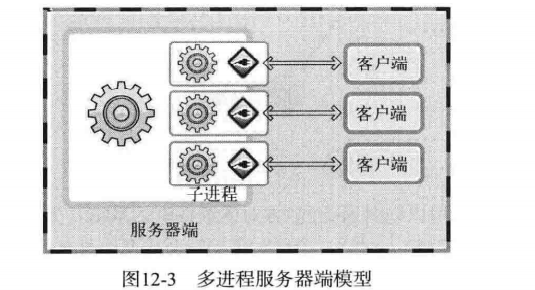
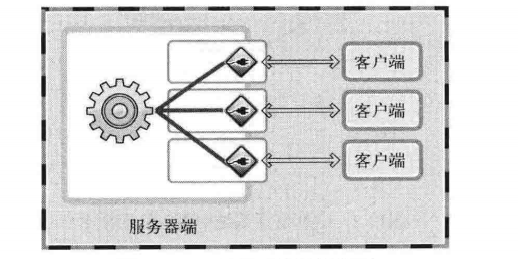
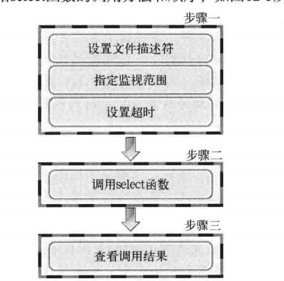
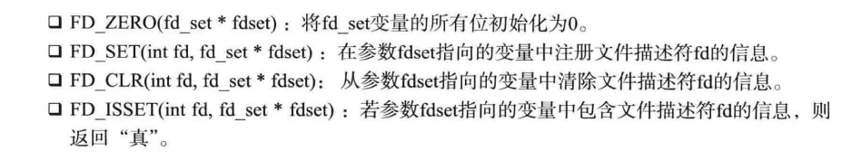
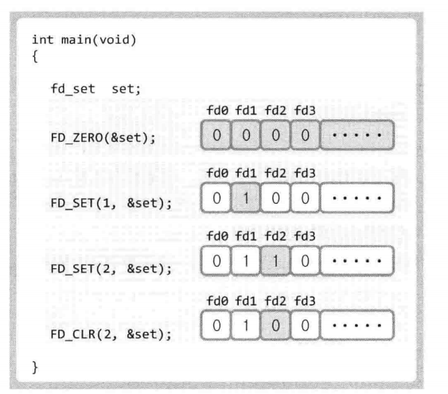
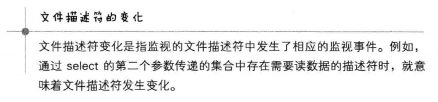
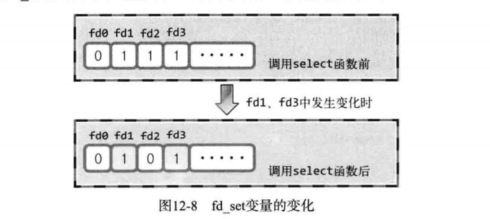
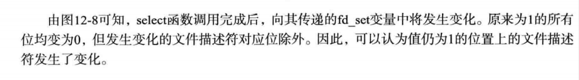
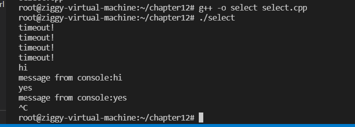

# I/O复用

## 基于I/O复用的服务器端

### 1.多进程服务器端的缺点

构建并发服务器，只要有客户端的连接请求，就会创建新进程，所以会付出大量的内存空间和运算

且每个进程都有独立的内存空间，导致相互间的数据交换也更为复杂（IPC(进程间通信)相对更复杂）

### 2.解决多进程服务器端的缺点

在不创建进程的同时向多个客户端提供服务：使用I/O复用

### 3.理解复用






**无论连接多少客户端，提供服务的进程只有一个**

## 实现服务器端（理解select函数）

select函数是最具代表性的实现复用服务器端的方法

使用select函数可以将多个文件描述符集中到一起统一监视

监视项称为事件：三种：

1. 是否存在套接字接收数据
2. 无需阻塞传输数据的套接字有哪些
3. 哪些套接字发生了异常

### select函数的调用方法和顺序



#### 1.设置文件描述符

监视文件描述符可以视为监视套接字

使用fd_set数组，如果所在位的值为1则代表此下标对应的文件描述符是监视对象


fd_set的操作是以位为单位进行的，使用下列宏进行：




`FD_ISSET(int fd,fd_set* fdset);`用于验证select函数的调用结果

#### 2.select函数

```c++
 #include <unistd.h>

       int select(int nfds, fd_set *readfds, fd_set *writefds,
                  fd_set *exceptfds, struct timeval *timeout);

	nfds(maxfd)监视对象文件描述符数量
    read：将所有关注是否存在待读取数据的文件描述符注册到fd_set型变量，并传递其地址值
    write：将所有关注是否可传输无阻塞数据的文件描述符注册到fd_set型变量，并传递其地址值
    except：将所有关注是否发生异常的文件描述符注册到fd_set型变量，并传递其地址值   
    timeout：调用select函数后，为防止陷入无限阻塞状态，传递超时信息
    发生错误返回-1，超时返回0，因发生关注的事件返回时，返回大于0的值（即为发生事件的文件描述符数）
```

### 文件描述符的监视范围

要传递第一个参数（需要得到注册在fd_set变量中的文件描述符数）

文件描述符的值从0开始，所以第一个参数传入当前最大的文件描述符值+1即可

### 超时时间

```c++
struct timeval
{
	long tv_sec;
	long tv_usec;
}
```

select函数只有在监视的文件描述符发生变化时返回，未发生变化则会进入阻塞状态

指定超时时间以防止以上情况的发生

秒数填入tv_sec,毫秒填入tv_usec

这样即使文件描述符未发生变化，过了指定时间，也可以从函数返回（此时返回0）

不想设置超时可以传递NULL

### 调用select函数后查看结果







```c++
//监视标准输入（控制台输入）
#include<unistd.h>
#include<stdio.h>
#include<sys/socket.h>
#include<sys/time.h>


#define BUF_SIZE 30
int main()
{
    fd_set reads,temps;
    int result,str_len;
    char buf[BUF_SIZE];
    struct timeval timeout;
    FD_ZERO(&reads);
    //监视标准输入的变化
    // 使用fd_set数组，如果所在位的值为1则代表此下标对应的文件描述符是监视对象


    FD_SET(0,&reads);

    // timeout.tv_sec = 5;
    // timeout.tv_usec = 5000;

    while(1){
        temps = reads;
        timeout.tv_sec = 5;
        timeout.tv_usec = 0;
        result = select(1,&temps,0,0,&timeout);
        if(result==-1){
            puts("select error!");
            break;
        }
        else if(result==0){
            puts("timeout!");
        }
        else{
            if(FD_ISSET(0,&temps)){
                str_len = read(0,buf,BUF_SIZE);
                buf[str_len] = 0;
                printf("message from console:%s",buf);

            }
        }
    }

    //调用selet后，出了发生变化的文件描述符的对应位外，都将变为0
    // 为了记住初始值，必须进行reads到temps的复制过程
    // 调用select函数后，每次超时时间的值都会被替换为超时前的剩余时间，所以要在循环中定义超时时间

    return 0;
}
```



```c++
#include<iostream>
#include<sys/socket.h>
#include<arpa/inet.h>
#include<unistd.h>
#include<stdlib.h>
#include<stdio.h>
#include<arpa/inet.h>
#include<string.h>
#include<sys/select.h>

#define BUF_SIZE 100
void error_handling(char *buf);

int main(int argc,char *argv[])
{
    int serv_sock,clnt_sock;
    struct sockaddr_in serv_adr,clnt_adr;
    struct timeval timeout;
    fd_set reads,cpy_reads;

    socklen_t adr_sz;
    int fd_max,str_len,fd_num,i;

    char buf[BUF_SIZE];
    if(argc!=2){
        printf("Usage:%s <port>",argv[0]);//打印使用方法
        exit(1);
    }
    serv_sock = socket(PF_INET,SOCK_STREAM,0);

// 指定ip地址和端口号和ip协议族
    memset(&serv_adr,0,sizeof(serv_adr));
    serv_adr.sin_family = AF_INET;
    serv_adr.sin_addr.s_addr = htonl(INADDR_ANY);
    serv_adr.sin_port = htons(atoi(argv[1]));
    if(bind(serv_sock,(struct sockaddr*)&serv_adr,sizeof(serv_adr))==-1){
        error_handling("bind() error");
    }
    if(listen(serv_sock,5)==-1){
        error_handling("listen() error");
    }

    // 初始化reads数组为全0
    FD_ZERO(&reads);
    //向reads（select的第二个参数）注册服务器端套接字，
    // 如此接收数据的监视对象就包含了服务器端套接字
    // 客户端的连接请求同样通过传输数据完成，这样如果服务器端套接字中有接收的数据
    // 则代表有新的连接请求
    FD_SET(serv_sock,&reads);
    fd_max = serv_sock;

    while(1){
        cpy_reads = reads;//使用select的必备流程
        timeout.tv_sec = 5;
        timeout.tv_usec = 5000;
        //调用select函数，传入监视对象的最大数（范围），和cpy_reads(根据监视的目的传递参数)
        if((fd_num=select(fd_max+1,&cpy_reads,0,0,&timeout))==-1){
            break;
        }
        if(fd_num==0){
            continue;
        }
        //查找有变化的套接字文件描述符（有接收数据的套接字）
        for(int i = 0;i<fd_max+1;i++){
            if(FD_ISSET(i,&cpy_reads)){
                //如果有变化
                // 验证是否时服务器端套接字发生变化
                if(i==serv_sock){
                    //受理连接请求
                    adr_sz = sizeof(clnt_adr);
                    clnt_sock = accept(serv_sock,(struct sockaddr*)&clnt_sock,&adr_sz);
                    FD_SET(clnt_sock,&reads);//????????????????????
                    if(fd_max<clnt_sock){
                        fd_max = clnt_sock;
                    }    
                    printf("connected client:%d\n",clnt_sock);

                }
                else{
                    //发生变化的并非服务器端套接字，而是有要接受的数据时
                    // 先确认是要接受的数据还是代表断开连接的EOF
                    str_len = read(i,buf,BUF_SIZE);
                    if(str_len==0){
                        FD_CLR(i,&reads);//关闭连接
                        close(i);
                        printf("close client :%d\n",i);

                    }
                    else{
                        write(i,buf,str_len);//回声，此时传来的不是EOF

                    }
                }
            }
        }
    }
    close(serv_sock);
    return 0;
}

void error_handling(char *buf){
    fputs(buf,stderr);
    fputc('\n',stderr);
    exit(1);
}
```

