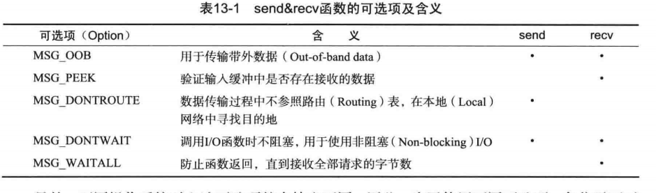

# 多种I/O函数

## send & recv函数

```c++
       #include <sys/socket.h>

       ssize_t send(int sockfd, const void *buf, size_t nbytes/* len */, int flags);
成功返回发送的字节数，失败返回-1
	sockfd ：与数据传输对象的连接的套接字文件描述符
	buf ：待传输数据的缓冲地址值
    nbytes ： 待传输的字节数
    flags ：传输数据时指定的可选项信息
    
       #include <sys/socket.h>

       ssize_t recv(int sockfd, void *buf, size_t len, int flags); 
	sockfd ：与数据接收对象的连接的套接字文件描述符
	buf ：保存接收数据的缓冲地址值
    nbytes ： 可接收的最大字节数
    flags ：传输数据时指定的可选项信息
```



MSG_OOB用于创建特殊发送方法和通道用于发送紧急消息

```

```

