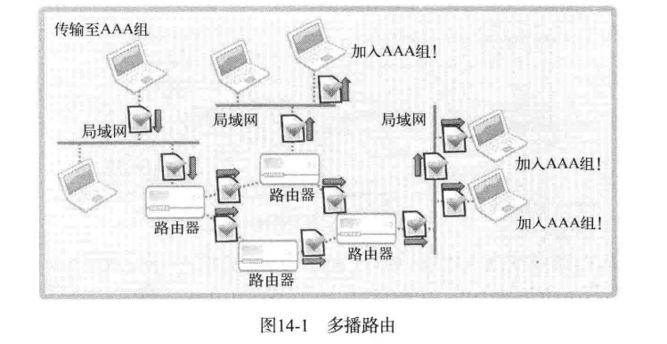
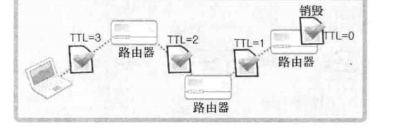

# 广播和多播


UDP 服务器和客户端都只需要一个socket

TCP中服务端socket与客户端是一对一关系

与10个客户端收发数据，则负责传送数据的服务端socket要10个

只需一个UDP socket即可向任意主机传送数据

但是当有一万名用户，则使用TCP需要维护一万socket，使用UDP也需要一万次数据传输

## 使用多播解决以上问题（向大量客户端发送相同数据）

多播基于UDP

区别：UDP数据传输以单一目标进行，而多播同时将数据传输到加入（注册）特定组的大量主机

使用多播可以同时向多个主机传输数据

多播的特点：

- 多播服务端针对特定多播组，只发送一次数据
- 虽然只发送一次，但是组内所有客户端都会接收数据
- 多播组数可以在IP地址范围内任意增加
- 加入特定组即可接收发往该多播组的数据

多播组是D类IP地址：`(224.0.0.0-239.255.255.255)`

多播数据包的格式与UDP数据包相同，但是向网络传递一个多播数据包时，路由器将该数据包复制并传递到多个主机



### 路由和TTL(生存时间)，以及加入组的方法

TTL是决定数据包传递距离的主要因素，用整数表示，且每经过一个路由器就减1

变为0时，数据包无法再被传递，只能销毁



```c++
//设置TTL(例如设置为64)
int send_sock;
int time_live = 64;
send_sock = socket(PF_INET,SOCK_DGRAM,0);
//与设置TTL相关的协议层为IPPROTO_IP,选项名为IP_NULTICAST_TTL
setsockopt(send_sock,IPPROTO_IP,IP_NULTICAST_TTL,(void*)&time_live,sizeof(time_live));
```

```c++
//加入多播组
//与加入多播组相关的协议层为IPPROTO_IP,选项名为IP_ADD_MEMBERSHIIP、
int recv_sock;
struct ip_mreq join_adr;
recv_sock = socket(PF_INET,SOCK_DGRAM,0);
join_adr.imr_multiaddr.s_addr = "多播组地址信息";
join_adr.imr_interface.s_addr = "加入多播组的主机地址信息";
setsockopt(recv_sock,IPPROTO_IP,IP_ADD_MEMBERSHIP,(void*)&join_adr,sizeof(join_adr));


//ip_mreq结构体：
struct ip_mreq{
	struct in_addr imr_multiaddr;//加入的组的IP地址
    struct in_addr imr_interface;//加入该组的套接字所属主机的IP地址（也可以使用INADDR_ANY）
}
```

### 实现多播Sender，Receiver

分别替代服务端和客户端

示例场景：
Sender向AAA组广播文件中保存的新闻信息

Receiver接收传递到AAA组的新闻信息

```c++
//receiver
#include<iostream>
#include<stdio.h>
#include<stdlib.h>
#include<string.h>
#include<unistd.h>
#include<fcntl.h>
#include<sys/socket.h>
#include<sys/types.h>
#include<arpa/inet.h>

#define TTL 64
#define BUF_SIZE 30

void error_handling(char *message);


int main(int argc,char *argv[]){
    int recv_sock;

    struct sockaddr_in adr;//
    struct ip_mreq join_adr;
    int str_len;
    char buf[BUF_SIZE];
    if(argc!=3){
        printf("Usage:%s<groupIP> <port>\n",argv[0]);
        exit(1);
    }

    recv_sock = socket(PF_INET,SOCK_DGRAM,0);
    memset(&adr,0,sizeof(adr));
    adr.sin_family = AF_INET;
    adr.sin_addr.s_addr = htonl(INADDR_ANY);

    adr.sin_port = htons(atoi(argv[2]));
    if(bind(recv_sock,(struct sockaddr*)&adr,sizeof(adr))==-1){
        error_handling("bind() error");
    }
    join_adr.imr_interface.s_addr = htonl(INADDR_ANY);
    join_adr.imr_multiaddr.s_addr = inet_addr(argv[1]);
    setsockopt(recv_sock,IPPROTO_IP,IP_ADD_MEMBERSHIP,(void*)&join_adr,sizeof(join_adr));

    while(1){
        str_len = recvfrom(recv_sock,buf,BUF_SIZE-1,0,NULL,0);
        if(str_len<0){
            break;
        }
        buf[str_len] = 0;
        printf("%d\n",str_len);
        fputs(buf,stdout);

    }
    close(recv_sock);
    return 0;
}   

void error_handling(char *buf){
    fputs(buf,stderr);
    fputc('\n',stderr);
    exit(1);
}
```

```c++
//sender
#include<iostream>
#include<stdio.h>
#include<stdlib.h>
#include<string.h>
#include<unistd.h>
#include<fcntl.h>
#include<sys/socket.h>
#include<sys/types.h>
#include<arpa/inet.h>

#define TTL 64
#define BUF_SIZE 30

void error_handling(char *message);


int main(int argc,char *argv[]){
    int send_sock;
    struct sockaddr_in mul_adr;//多播组的地址信息
    int time_live = TTL;
    FILE *fp;
    char buf[BUF_SIZE];
    if(argc!=3){
        printf("Usage:%s<groupIP> <port>\n",argv[0]);
        exit(1);
    }
    send_sock = socket(PF_INET,SOCK_DGRAM,0);
    memset(&mul_adr,0,sizeof(mul_adr));
    mul_adr.sin_family = AF_INET;
    //多播组IP
    mul_adr.sin_addr.s_addr = inet_addr(argv[1]);
    //多播组端口
    mul_adr.sin_port = htons(atoi(argv[2]));
    setsockopt(send_sock,IPPROTO_IP,IP_MULTICAST_TTL,(void*)&time_live,sizeof(time_live));
    if((fp=fopen("news.txt","r"))==NULL){
        error_handling("fopen() error");
    }
    while(!feof(fp)){
        fgets(buf,BUF_SIZE,fp);
        sendto(send_sock,buf,strlen(buf),0,(struct sockaddr*)&mul_adr,sizeof(mul_adr));
        sleep(2);

    }
    fclose(fp);
    close(send_sock);
    return 0;
}   

void error_handling(char *buf){
    fputs(buf,stderr);
    fputc('\n',stderr);
    exit(1);
}
```


## 广播

向同一网络的所有主机传输数据，也基于UDP

两种形式：
直接广播，本地广播，二者的差别在于IP地址

直接广播的IP地址除了网络地址之外主机地址全设置为1

例如要向网络地址192.12.34的所有主机传输时，可以向192.12.34.255传输

本地广播的地址限定为255.255.255.255，

数据通信中使用的IP地址是与UDP示例唯一的区别

且默认生成的套接字会阻止广播

```
int send_sock;
int bcast = 1;
send_sock = socket(PF_INET,SOCK_DGRAM,0);
setsockopt(send_sock,SOL_SOCKET,SP_BROADCAST,(void*)&bcast,sizef(bcast));
将选项设置为1，意味着可以进行数据广播，上面的套接字选项只需在Sender中更改
//
```

```c++
//brd_re
#include<iostream>
#include<stdio.h>
#include<stdlib.h>
#include<string.h>
#include<unistd.h>
#include<fcntl.h>
#include<sys/socket.h>
#include<sys/types.h>
#include<arpa/inet.h>

#define BUF_SIZE 30

void error_handling(char *message);


int main(int argc,char *argv[]){
    int recv_sock;

    struct sockaddr_in adr;//
    int str_len;
    char buf[BUF_SIZE];
    if(argc!=2){
        printf("Usage:%s<port>\n",argv[0]);
        exit(1);
    }

    recv_sock = socket(PF_INET,SOCK_DGRAM,0);
    memset(&adr,0,sizeof(adr));
    adr.sin_family = AF_INET;
    adr.sin_addr.s_addr = htonl(INADDR_ANY);

    adr.sin_port = htons(atoi(argv[1]));
    if(bind(recv_sock,(struct sockaddr*)&adr,sizeof(adr))==-1){
        error_handling("bind() error");
    }

    while(1){
        str_len = recvfrom(recv_sock,buf,BUF_SIZE-1,0,NULL,0);
        if(str_len<0){
            break;
        }
        buf[str_len] = 0;
        fputs(buf,stdout);

    }
    close(recv_sock);
    return 0;
}   

void error_handling(char *buf){
    fputs(buf,stderr);
    fputc('\n',stderr);
    exit(1);
}
```

```c++
//brd_sender
#include<iostream>
#include<stdio.h>
#include<stdlib.h>
#include<string.h>
#include<unistd.h>
#include<fcntl.h>
#include<sys/socket.h>
#include<sys/types.h>
#include<arpa/inet.h>

#define TTL 64
#define BUF_SIZE 30

void error_handling(char *message);


int main(int argc,char *argv[]){
    int send_sock;
    struct sockaddr_in broad_adr;
    FILE *fp;
    char buf[BUF_SIZE];
    if(argc!=3){
        printf("Usage:%s<groupIP> <port>\n",argv[0]);
        exit(1);
    }
    int so_brd = 1;
    send_sock = socket(PF_INET,SOCK_DGRAM,0);
    memset(&broad_adr,0,sizeof(broad_adr));
    broad_adr.sin_family = AF_INET;
    broad_adr.sin_addr.s_addr = inet_addr(argv[1]);
    broad_adr.sin_port = htons(atoi(argv[2]));
    //修改选项，使之能够广播数据
    setsockopt(send_sock,SOL_SOCKET,SO_BROADCAST,(void*)&so_brd,sizeof(so_brd));

    if((fp=fopen("news.txt","r"))==NULL){
        error_handling("fopen() error");
    }
    while(!feof(fp)){
        fgets(buf,BUF_SIZE,fp);
        sendto(send_sock,buf,strlen(buf),0,(struct sockaddr*)&broad_adr,sizeof(broad_adr));
        sleep(2);

    }
    fclose(fp);
    close(send_sock);
    return 0;
}   

void error_handling(char *buf){
    fputs(buf,stderr);
    fputc('\n',stderr);
    exit(1);
}
```

