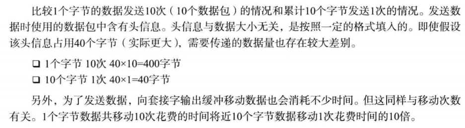

# 套接字和标准I/O

## 标准I/O函数的优点

具有良好的移植性：所有的标准函数都具有良好的移植性，且为了支持所有操作系统，它们都是按照ANSI C标准定义的

可以利用缓冲提高性能：创建套接字时，操作系统将生成用于I/O的缓冲，在执行TCP协议时发挥重要作用，此时使用标准I/O函数，则会得到额外的另一种缓冲的支持


例如：
使用fputs()函数传输字符串时，首先将数据传递到标准I/O函数的缓冲中，然后数据移动到套接字输出缓冲，最后字符串发送给对方主机

设置缓冲的目的最主要的就是提高性能，而套接字的缓冲主要是为了实现TCP协议而设定的

例：TCP传输中丢失数据时将再次传递，这意味着丢失的数据在某地保存了，没错，就存在套接字的输出缓冲中

所以需要使用标准I/O函数的缓冲来提高性能

缓冲对性能的影响：


### 性能对比

（1）使用未设置缓冲的read&write函数：

````c++
#include<iostream>
#include<stdio.h>
#include<stdlib.h>
#include<string.h>
#include<unistd.h>
#include<fcntl.h>
#include<sys/socket.h>
#include<sys/types.h>
#include<arpa/inet.h>

#define BUF_SIZE 3

int main()
{
    int fd1,fd2;
    int len;
    char buf[BUF_SIZE];
    fd1 = open("news.txt",O_RDONLY);
    fd2 = open("cpy.txt",O_WRONLY|O_TRUNC);

    while((len = read(fd1,buf,sizeof(buf)))>0){
        write(fd2,buf,len);

    }
    close(fd1);
    close(fd2);
    return 0;
}
````

(2)使用标准I/O函数

```c++
#include<iostream>
#include<stdio.h>
#include<stdlib.h>
#include<string.h>
#include<unistd.h>
#include<fcntl.h>
#include<sys/socket.h>
#include<sys/types.h>
#include<arpa/inet.h>

#define BUF_SIZE 3

int main()
{
    FILE* fd1,*fd2;
    char buf[BUF_SIZE];
    //基于缓冲的复制，使用标准I/O函数
    fd1 = fopen("news.txt","r");
    fd2 = fopen("cpy.txt","w");

    while(fgets(buf,BUF_SIZE,fd1)!=NULL){
        fputs(buf,fd2);

    }
    fclose(fd1);
    fclose(fd2);
    return 0;
}
```

### 标准I/O函数的几个缺点

不容易进行双向通信

可能频繁调用fflush函数

需要以FILE结构体指针形式返回文件描述符

### 创建套接字时默认返回文件描述符，所以需要将文件描述符转换为FILE指针

## 使用标准I/O函数

### 文件描述符转换为FILE指针的方法

```c++
#include<stdio.h>
FILE* fdopen(int fildes,const char* mode);
//成功返回转换的FILE结构体指针，失败返回NULL

fildes：需要转换的文件描述符
mode：创建的FILE结构体指针的模式信息
```

mode参数与fopen函数中的打开模式相同，常用的有读模式：“r”，写模式：“w”

```c++
//文件描述符的转换
#include<stdio.h>
#include<fcntl.h>


int main()
{
    FILE *fp;
    int fd = open("data.dat",O_WRONLY|O_CREAT|O_TRUNC);
    if(fd==-1){
        fputs("file open error",stdout);
        return -1;
    }
    fp = fdopen(fd,"w");//返回写模式的FILE指针
    fputs("network C programming",fp);//标准输出函数
    fclose(fp);//利用FILE指针关闭文件，此时无需再通过文件描述符关闭
  //调用fclose后文件描述符变为毫无意义的整数
  
    return 0;
}
```


### 将FILE指针转换为文件描述符

```c++
#include<stdio.h>
int fileno(FILE* stream);
//成功返回文件描述符，失败返回-1
```

```c++
//用法
#include<stdio.h>
#include<fcntl.h>


int main()
{
    FILE *fp;
    int fd = open("data.dat",O_WRONLY|O_CREAT|O_TRUNC);
    if(fd==-1){
        fputs("file open error",stdout);
        return -1;
    }
    printf("first file descriptor:%d\n",fd);

    fp = fdopen(fd,"w");//返回写模式的FILE指针
    fputs("tcp socket program",fp);//标准输出函数
    printf("second file descriptor:%d\n",fileno(fp));
    
    fclose(fp);//利用FILE指针关闭文件，此时无需再通过文件描述符关闭
  //调用fclose后文件描述符变为毫无意义的整数
  
    return 0;
}
```


## 基于套接字的标准I/O函数的使用

在第四章回声客户端的基础上使用标准I/O函数

```c++
#include<iostream>
#include<sys/socket.h>
#include<arpa/inet.h>
#include<unistd.h>
#include<stdlib.h>
#include<stdio.h>
#include<string.h>


// socket函数创建socket

// bind函数为socket分配ip地址和端口号

// listen函数将socket转换为可接收链接的状态


// accept函数用于接收对方的连接请求

//服务端同一时刻只与一个客户端相连
// 依次与五个客户端通信
#define BUFSIZE 1024

void error_handling(char *message);

int main(int argc,char *argv[]){

    int serv_sock;
    sockaddr_in serv_addr;
    char message[] = "hello world!";
    if(argc!=2){
        printf("Usage:%s <port>",argv[0]);//打印使用方法
        exit(1);
    }
    serv_sock = socket(PF_INET,SOCK_STREAM,0);
    if(serv_sock==-1){
        error_handling("socket() error");
    }
    FILE* readfp;
    FILE* writefp;
// 指定ip地址和端口号和ip协议族
    memset(&serv_addr,0,sizeof(serv_addr));
    serv_addr.sin_family = AF_INET;
    serv_addr.sin_addr.s_addr = htonl(INADDR_ANY);
    serv_addr.sin_port = htons(atoi(argv[1]));
    if(bind(serv_sock,(struct sockaddr*)&serv_addr,sizeof(serv_addr))==-1){
        error_handling("bind() error");
    }
    if(listen(serv_sock,5)==-1){
        error_handling("listen() error");
    }
    int str_len;
    int clnt_sock;
    sockaddr_in clnt_addr;
    socklen_t clint_addr_size;

    //五个客户端则要生成五个用于I/O的socket
    //使用循环
    // 要实现echo则在每次循环中使用while，一直接收和发送信息，直到用户输入q（quit）
    for(int i = 0;i<5;i++){

        clint_addr_size = sizeof(clnt_addr);
        clnt_sock=accept(serv_sock,(struct sockaddr*)&clnt_addr,&clint_addr_size);

        if(clnt_sock==-1){
            error_handling("accept() error");
        }
        else printf("Connected client %d\n",i+1);

        readfp = fdopen(clnt_sock,"r");
        writefp = fdopen(clnt_sock,"w");

        while (!feof(readfp))//注意加括号，防止优先级错误
        {
            fgets(message,BUFSIZE,readfp);
            fputs(message,writefp);
            fflush(writefp);//如果不调用此函数则无法保证立即将数据传输到客户端

        }
        fclose(readfp);
        fclose(writefp);        
    }
    close(serv_sock);
    return 0;
}
void error_handling(char *message){
    fputs(message,stderr);
    fputc('\n',stderr);
    exit(1);
}
```

```c++
#include<iostream>
#include<sys/socket.h>
#include<arpa/inet.h>
#include<unistd.h>
#include<stdlib.h>
#include<stdio.h>
#include<arpa/inet.h>
#include<string.h>

#define BUF_SIZE 1024
void error_handling(char *message);

// connect()请求连接函数


int main(int argc,char* argv[]){
    int sock;
    sockaddr_in serv_addr;
    char message[30];
    int str_len;

    if(argc!=3){
        printf("Usage:%s<ip> <port>\n",argv[0]);
        exit(1);
    }
    FILE* readfp;
    FILE* writefp;
    sock = socket(PF_INET,SOCK_STREAM,0);
    if(sock==-1){
        error_handling("socket() error");
    }

    memset(&serv_addr,0,sizeof(serv_addr));
    serv_addr.sin_family = AF_INET;
    serv_addr.sin_addr.s_addr = inet_addr(argv[1]);
    serv_addr.sin_port = htons(atoi(argv[2]));

    if(connect(sock,(struct sockaddr*)&serv_addr,sizeof(serv_addr))==-1){
        error_handling("connect() error");
    }
    else
        puts("Connected.........");

    readfp = fdopen(sock,"r");
    writefp = fdopen(sock,"w");

    while (1)//实现echo，使用循环，直到用户输入q位置都一直收发信息
    {
        fputs("Input message(Q/q to quit):",stdout);
        fgets(message,BUF_SIZE,stdin);
        if(!strcmp(message,"q\n")||!strcmp(message,"Q\n")){
            break;
        }
        fputs(message,writefp);
        fflush(writefp);
        fgets(message,BUF_SIZE,readfp);


        printf("Message from server:%s\n",message);
    }
    
    // str_len = read(sock,message,sizeof(message)-1);
    // if(str_len==-1){
    //     error_handling("read() error!");
    // }

    // printf("Message from server: %s\n",message);
    fclose(readfp);
    fclose(writefp);
    
    return 0;
}
void error_handling(char *message){
    fputs(message,stderr);
    fputc('\n',stderr);
    exit(1);
}
```

使用标准I/O函数后可以按字符串单位进行数据交换，无需在数据的尾部插入0来转换为字符串