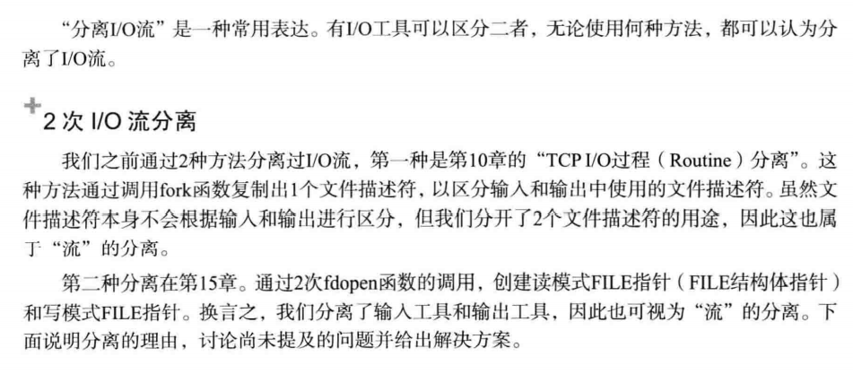

# I/O流分离

调用fopen函数打开文件后，可以与文件交换数据，我们说调用fopen函数后创建了流，可以理解为数据的收发路径

## 分离I/O流



### 分离流的好处

第十章分离流的目的：
分开输入输出过程代码降低实现难度

与输入无关的输出操作可以提高速度

第十五章的分离目的：

为了将FILE指针按读写模式加以区分

降低实现难度

区分I/O缓冲提高缓冲性能

### EOF问题（半关闭）

半关闭：可以接收数据但是无法发送数据的状态

第七章：shutdown(sock,SHUT_WR);基于半关闭的EOF传递方法

可以使用fclose针对输出模式的FILE指针关闭以达到半关闭状态吗？

使用实例验证：

```c++
#include<iostream>
#include<stdio.h>
#include<stdlib.h>
#include<string.h>
#include<unistd.h>
#include<fcntl.h>
#include<sys/socket.h>
#include<sys/types.h>
#include<arpa/inet.h>
#define BUF_SIZE 1024

int main(int argc,char *argv[])
{
    int serv_sock,clnt_sock;
    FILE* readfp;
    FILE* writefp;
    struct sockaddr_in serv_adr,clnt_adr;
    socklen_t clnt_adr_sz;
    char buf[BUF_SIZE] = {0,};
    serv_sock = socket(PF_INET,SOCK_STREAM,0);
    memset(&serv_adr,0,sizeof(serv_adr));
    serv_adr.sin_family = AF_INET;
    serv_adr.sin_addr.s_addr = htonl(INADDR_ANY);
    serv_adr.sin_port = htons(atoi(argv[1]));
    bind(serv_sock,(struct sockaddr*)&serv_adr,sizeof(serv_adr));
    listen(serv_sock,5);
    clnt_adr_sz = sizeof(clnt_adr);
    clnt_sock = accept(serv_sock,(struct sockaddr*)&clnt_adr,&clnt_adr_sz);
    readfp = fdopen(clnt_sock,"r");
    writefp = fdopen(clnt_sock,"w");
    fputs("from server:hi client\n",writefp);
    fputs("from server:hi client sentence 2\n",writefp);
    fputs("from server:hi client sentence 3\n",writefp);

    fflush(writefp);
//调用fclose终止套接字时，对方主机会收到EOF
    fclose(writefp);
    fgets(buf,sizeof(buf),readfp);
    fputs(buf,stdout);
    fclose(readfp);

    return 0;

}

```

```c++
//sep_clnt.cpp
#include<iostream>
#include<stdio.h>
#include<stdlib.h>
#include<string.h>
#include<unistd.h>
#include<fcntl.h>
#include<sys/socket.h>
#include<sys/types.h>
#include<arpa/inet.h>
#define BUF_SIZE 1024

int main(int argc,char *argv[])
{
    int sock;
    FILE* readfp;
    FILE* writefp;
    struct sockaddr_in serv_adr;
    socklen_t clnt_adr_sz;
    char buf[BUF_SIZE];
    sock = socket(PF_INET,SOCK_STREAM,0);
    memset(&serv_adr,0,sizeof(serv_adr));
    serv_adr.sin_family = AF_INET;
    serv_adr.sin_addr.s_addr = inet_addr(argv[1]);
    serv_adr.sin_port = htons(atoi(argv[2]));

    connect(sock,(struct sockaddr*)&serv_adr,sizeof(serv_adr));


    readfp = fdopen(sock,"r");
    writefp = fdopen(sock,"w");


    while(1){
        if(fgets(buf,sizeof(buf),readfp)==NULL){//收到EOF时退出循环
            break;
        }
        fputs(buf,stdout);
        fflush(stdout);
    }
    fputs("from client:thank you\n",writefp);
    fflush(writefp);
    fclose(writefp);
    fclose(readfp);
    return 0;
}
```


服务器端未收到最后的字符串

**因为fclose函数完全终止了套接字，而不是半关闭**

## 文件描述符的复制和半关闭

### 使用fclose无法实现半关闭的原因


### 如何实现半关闭？


创建FILE指针之前先复制一份文件描述符即可

套接字和文件描述符之间的关系：销毁所有的文件描述符后才能销毁套接字


此时还未进入半关闭状态，因为还剩一个文件描述符且此文件描述符可以同时进行I/O

因此不但没有发送EOF,而且还可以用文件描述符进行输出

解决：

### 1.复制文件描述符

之前的复制是使用fork复制整个进程，所以同一个进程内不能有原件和副本

如何在同一进程内完成描述符的复制？


文件描述符的值不能重复

此处的复制并不是将文件描述符整数值在内的所有内容进行复制

而是为了访问同一文件或套接字，创建了另外一个文件描述符

使用到的函数：

```c++
#include<unistd.h>
int dup(int fildes);
int dup2(int fildes,int fildes2);
成功返回复制的文件描述符，失败返回-1
    fildes：需要复制的文件描述符
    fildes2：明确指定的文件描述符整数值
```

```c++
#include<stdio.h>
#include<unistd.h>


int main(){
    //复制自动打开的标准输出文件描述符1，使用复制的文件描述符输出
    // 自动打开的0，1，2描述符与套接字文件描述符并无区别
    int cfd1,cfd2;
    char str1[] = "hi\n";
    char str2[] = "hello";
    cfd1 = dup(1);
    cfd2 = dup2(cfd1,7);
    printf("fd1 = %d , fd2 = %d\n",cfd1,cfd2);
    write(cfd1,str1,sizeof(str1));
    write(cfd2,str2,sizeof(str2));
    close(cfd1);
    close(cfd2);//终止复制的文件描述符但是还有原本的描述符，所以仍然可以输出
    write(1,str1,sizeof(str1));
    close(1);
    write(1,str2,sizeof(str2));//无法输出
    return 0;
}
```


### 复制文件描述符后流的分离

修改sep_serv.cpp

使之能够半关闭工作

```c++
//sep_serv2.cpp
#include<iostream>
#include<stdio.h>
#include<stdlib.h>
#include<string.h>
#include<unistd.h>
#include<fcntl.h>
#include<sys/socket.h>
#include<sys/types.h>
#include<arpa/inet.h>
#define BUF_SIZE 1024

int main(int argc,char *argv[])
{
    int serv_sock,clnt_sock;
    FILE* readfp;
    FILE* writefp;
    struct sockaddr_in serv_adr,clnt_adr;
    socklen_t clnt_adr_sz;
    char buf[BUF_SIZE] = {0,};
    serv_sock = socket(PF_INET,SOCK_STREAM,0);
    memset(&serv_adr,0,sizeof(serv_adr));
    serv_adr.sin_family = AF_INET;
    serv_adr.sin_addr.s_addr = htonl(INADDR_ANY);
    serv_adr.sin_port = htons(atoi(argv[1]));
    bind(serv_sock,(struct sockaddr*)&serv_adr,sizeof(serv_adr));
    listen(serv_sock,5);
    clnt_adr_sz = sizeof(clnt_adr);
    clnt_sock = accept(serv_sock,(struct sockaddr*)&clnt_adr,&clnt_adr_sz);
    readfp = fdopen(clnt_sock,"r");
    writefp = fdopen(dup(clnt_sock),"w");
    fputs("from server:hi client\n",writefp);
    fputs("from server:hi client sentence 2\n",writefp);
    fputs("from server:hi client sentence 3\n",writefp);

    fflush(writefp);
    //针对fileno返回值（即为dup(clnt_sock)）,服务端进入半关闭状态

    shutdown(fileno(writefp),SHUT_WR);//服务器进入半关闭且向客户端发送EOF
   // 无论复制出多少文件描述符，均应调用shutdown函数发送EOF并进入半关闭状态
//调用fclose终止套接字时，对方主机会收到EOF
    fclose(writefp);
    fgets(buf,sizeof(buf),readfp);
    fputs(buf,stdout);
    fclose(readfp);
    return 0;
}
```

