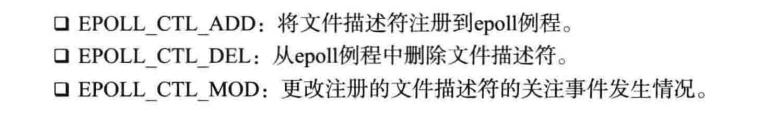
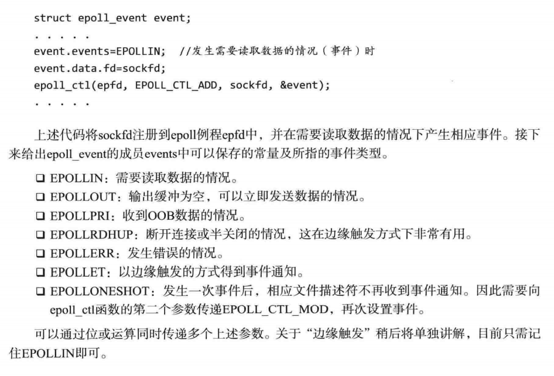

# epoll

## 基于select的I/O复用的缺点：

调用select之后，并不是把发生变化的文件描述符单独集中到一起，而是通过观察作为监视对象的fd_set变量的变化，无法避免的使用循环找出发生变化的文件描述符，而且作为监视对象的fd_set变量会发生变化，所以调用select之前应保存原有信息，并且每次调用select函数时要传入新的监视对象信息

每次调用select函数时向操作系统传递监视对象信息会对程序造成很大的负担，且无法通过优化代码解决

select是监视套接字变化的函数，而套接字由操作系统管理，所以select函数绝对需要借助操作系统才能完成功能

弥补缺点：
仅向操作系统传递一次监视对象，监视范围或内容变化时，只通知发生变化的事项

Linux实现上述功能的是epoll，Windows是IOCP

但是select也有兼容性的优点

服务端接入者少时，考虑兼容性可以仍然使用select

## epoll的优点：

1. 无需编写以监视状态变化为目的的针对所有文件描述符的循环语句
2. 调用epoll_wait函数（对应select）无需每次传递监视对象信息

### epoll服务端实现中需要的三个函数

- epoll_create();创建保存epoll文件描述符的空间
- epoll_ctl();向空间注册并注销文件描述符
- epoll_wait();类似于select，等待文件描述符发生变化

select中保存监视对象文件描述符的是我们直接声明的fd_set变量，epoll下由操作系统负责保存监视对象文件描述符，因此需要向操作系统请求创建保存文件描述符的空间

添加和删除监视对象文件描述符，select中用到：FD_SET,FD_CLR

epoll中通过epoll_ctl请求操作系统完成

查看监视对象的状态变化（事件是否发生）也不一样，select通过fd_set，epoll中通过epoll_event将发生变化的文件描述符集中到一起

````c++
struct epoll_event
{
	__unit32_t events;
	epoll_data_t data;
}

typedef union epoll_date{
	void * ptr;
	int fd;
	__unit32_t u32;
	__unit64_t u64;
}epoll_data_t;
````

声明足够大的epoll_event结构体数组后，传递给epoll_wait函数，发生变化的文件描述符信息将被填入该数组

```c++
#include<sys/epoll.h>
int epoll_create(int size);
成功返回epoll文件描述符，失败返回-1
调用此函数创建的文件描述符保存空间称为epoll例程
size决定其大小（只是给操作系统左参考，实际大小不是由size决定）
例程也由操作系统管理，该函数返回的文件描述符主要用于区分epoll例程，终止时也要调用close函数
```

在例程内部注册监视对象文件描述符：

```c++
#include<sys/epoll.h>
int epoll_ctl(int epfd,int op,int fd,struct epoll_event* event);
成功返回0，失败返回-1
epfd：用于注册监视对象的epoll例程的文件描述符
op：用于指定监视对象的添加删除或更改等操作
fd：需要注册的监视对象文件描述符
event：监视对象的事件类型
    
```





### epoll_wait

````c++
//epoll_wait
#include<sys/epoll.h>
int epoll_wait(int epfd,struct epoll_event* events,int maxevents,int timeout);
成功返回事件的文件描述符，失败返回-1
    epfd：事件发生监视范围的epoll例程文件描述符
	events：保存发生事件的文件描述符集合的结构体地址值
    maxevents：第二个参数中可以保存最大事件数
````


```c++
//函数的调用方式
int event_cnt;
struct epoll_event* ep_events;
ep_events = malloc(sizeof(struct epoll_event)*EPOLL_SIZE);
event_cnt = epoll_wait(epfd,ep_events,EPOLL_SIZE,-1);
```

调用函数后，返回发送事件的文件描述符数，同时在第二个参数指向的缓冲中保存发送事件的文件描述符集合，因此无需像select那样插入针对所有文件描述符的循环

### 基于epoll的回声服务端

```c++

```

## 条件触发和边缘触发

条件触发和边缘触发的区别在于发生事件的时间点

条件触发中只要输入缓冲有数据就会一直通知该事件

边缘触发中输入缓冲收到数据时仅注册一次事件