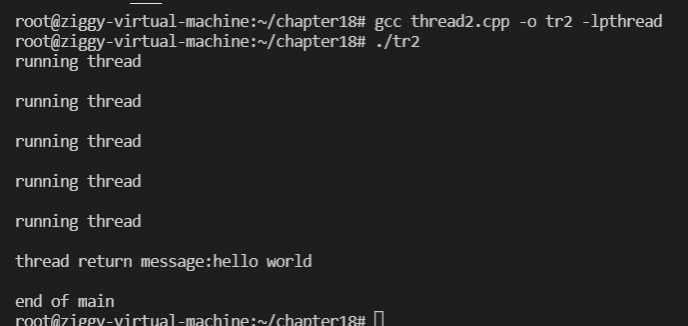

# 多线程服务端

## 线程的概念

### 多进程模型本身的缺点：

创建进程会给操作系统带来沉重的负担，每个进程都有独立的内存空间，所以进程间通信的难度也随之变高

更加致命是是多次的上下文切换：
运行程序前需要将相应进程信息读入内存，如果运行进程A后需要紧接着运行进程B，就应将A移出内存，读入进程B的相关信息，者就是上下文切换

多进程会造成更多的上下文切换，所以会影响性能

### 线程的优点

线程的创建和上下文切换更快

线程之间的数据交换无需特殊技术


线程上下文切换无需切换数据区和堆

可以利用数据区和堆交换数据

进程：在操作系统构成单独执行流的单位

线程：在进程构成单独执行流的单位


## 线程的创建和运行

基于POSIX标准

### 线程的创建和执行流程

```c++
       #include <pthread.h>

       int pthread_create(pthread_t *restrict thread, const pthread_attr_t *restrict attr, void *(*start_routine) (void *), void *restrict arg);

成功返回0，失败返回其他值
    thread：保存新创建线程ID的变量地址值
    attr：用于传递线程属性的参数，传递NULL则创建默认属性的线程
    start_routine：相当于线程main函数的，在单独执行流中执行的函数地址值（函数指针）
    arg：通过第三个参数传递调用函数时包含传递参数信息的变量地址值
```

```c++
//创建线程
#include<pthread.h>
#include<unistd.h>
#include<stdio.h>
#include<stdlib.h>

void * thread_main(void* arg){
    int cnt = *((int*)arg);
    for(int i = 0;i<cnt;i++){
        sleep(1);
        puts("running thread\n");
    }
    return NULL;
}

int main()
{
    pthread_t id;
    int thread_param = 5;
    pthread_create(&id,NULL,thread_main,(void*)&thread_param);//请求创建一个线程，并从传入的函数调用开始，在单独的执行流中运行
    sleep(10);
    puts("end of main");

    return 0;
}
```


线程相关代码编译时要添加-lpthread向下声明需要连接线程库，才能掉头用pthread.h头文件中声明的函数


进程终止，其中的线程也会终止


但这并不意味着我们要调用sleep去预测程序的执行流程

预测程序执行流程是几乎不可能实现的

所以我们不能使用sleep函数，而是使用另一个函数来控制线程的执行流

```c++
#include<pthread.h>
       #include <pthread.h>

       int pthread_join(pthread_t thread, void **retval/*  status  */);
//成功返回0，失败返回其他值
thread:该参数ID的线程终止后，函数才返回值
status：保存线程的main函数返回值的指针变量地址值(指针的地址)
```

```c++
//使用函数控制线程的执行流
#include<pthread.h>
#include<unistd.h>
#include<stdio.h>
#include<stdlib.h>
#include<string.h>
void * thread_main(void* arg){
    int cnt = *((int*)arg);
    for(int i = 0;i<cnt;i++){
        sleep(1);
        puts("running thread\n");
    }
    char*msg = (char*)malloc(sizeof(char)*50);
    strcpy(msg,"hello world\n");
    return (void*)msg;
}
int main()
{
    pthread_t id;
    int thread_param = 5;
    void* thr_ret;

    pthread_create(&id,NULL,thread_main,(void*)&thread_param);//请求创建一个线程，并从传入的函数调用开始，在单独的执行流中运行
    if(pthread_join(id,&thr_ret)!=0){
        //thr_ret中保存线程main函数的返回值，注意该返回值是函数内部动态分配的内存空间地址值
        puts("pthread_join() error");
        return -1;
    }
    printf("thread return message:%s\n",(char*)thr_ret);

    free(thr_ret);
    puts("end of main");

    return 0;
}
```

调用该函数的进程将进入等待状态，直到第一个参数为ID的线程终止，而且可以得到线程的main函数返回值



### 可在临界区内调用的函数

多个线程同时调用函数时可能产生问题，这类函数内部存在临界区

根据临界区是否引起问题，函数分为两类：
线程安全函数

非线程安全函数


### 工作（Worker）线程模型

多个线程的示例：
计算1-10的和，一个线程计算1-5，另一个计算6-10，main函数负责输出运算结果


```c++
#include<pthread.h>
#include<unistd.h>
#include<stdio.h>
#include<stdlib.h>
#include<string.h>

int sum = 0;

void * thread_sum(void* arg){
    int s = ((int*)arg)[0];
    int e = ((int*)arg)[1];
    while(s<=e){
        sum+=s;
        s++;
    }
    return NULL;

}

int main()
{
    pthread_t id_t1,id_t2;
    int range1[] = {1,5};
    int range2[] = {6,10};
    pthread_create(&id_t1,NULL,thread_sum,(void*)range1);
    
    pthread_create(&id_t2,NULL,thread_sum,(void*)range2);

    pthread_join(id_t1,NULL);
    
    pthread_join(id_t2,NULL);
    printf("result:%d\n",sum);

    return 0;
//之所以可以算出正确结果完全是因为两个线程共享保存全局变量的数据区

}
```


示例本身存在临界区相关问题

````c++
//临界区产生的问题：
#include<pthread.h>
#include<unistd.h>
#include<stdio.h>
#include<stdlib.h>
#include<string.h>


long long sum = 0;


#define NUM_THREAD 100

void* thread_inc(void* arg){
    for(int i = 0;i<50000000;i++){
        sum+=i;
    }
    return NULL;
}

void* thread_des(void* arg){
    for(int i = 0;i<50000000;i++){
        sum-=i;
    }
    return NULL;
}


int main()
{
    pthread_t thread_id[NUM_THREAD];
    printf("sizeof long long:%d\n",sizeof(long long));
    for(int i = 0;i<NUM_THREAD;i++){
        if(i%2){
            pthread_create(&(thread_id[i]),NULL,thread_inc,NULL);

        }
        else{
            pthread_create(&(thread_id[i]),NULL,thread_des,NULL);
        }
    }
    for(int i = 0;i<NUM_THREAD;i++){
        pthread_join(thread_id[i],NULL);
    }

    printf("result:%lld\n",sum);

    //创建一百个线程，一半执行函数1，一半执行函数2
    // 最后结果正确应为0


    return 0;

}
````

运算结果不为0，且每次不同


## 线程存在的问题和临界区

### 多个线程访问同一变量

此处的访问指的是值的更改，这与全局变量并不相关，而是任何内存空间只要被同时访问都有可能发生问题

值的增加方式：值的增加需要CPU的参与运算完成，线程1读值并将值传递给CPU，获得100，最后把结构写回变量num，但是在线程1完全增加num值之前，线程2有可能通过切换得到CPU资源

若线程1将num+1后的值还未写入num，在写入之前，执行流程跳转到了线程2


线程2将num加为了100，线程1又将自己的运算结果（100）写入num

此时虽然线程1，2都做了+1运算，但是num却只加了1

因此线程访问变量num时应阻止其他线程访问，这就是同步

### 临界区位置

临界区代码的定义：函数内同时运行多个线程时引起问题的多条语句构成的代码块

在thread4中，临界区并非num本身，而是访问num的两条运算语句


## 线程同步

### 同步的两面性

线程同步用于解决线程访问顺序引发的问题

需要同步的情况：
同时访问同一内存空间时发生的情况

需要指定访问同一内存空间的线程执行顺序的情况

例如：生产者消费者问题中的同步关系，线程A写入数据后，B才能取走数据，

### 互斥量

表示不允许多个线程同时访问 mutex

用于解决线程同步访问的问题


互斥量必须成对出现

互斥量的创建和销毁函数：

```c++
#include<pthread.h>

int pthread_mutex_init(pthread_mutex_t* mutex,const pthread_mutexattr_t* attr);;
int pthread_mutex_destory(pthread_mutex_t* mutex);

成功返回0，失败返回其他值
    mutex保存互斥量的变量地址值
    attr:传递即将创建的互斥量属性，没有特殊的传递NULL即可
```


推荐尽量还是使用函数进行初始化

```c++
//利用互斥量所著或释放临界区时使用的函数
#include<pthread.h>
int pthread_mutex_lock(pthread_mutex_t* mutex);
int pthread_mutex_unlock(pthread_mutex_t* mutex);
成功返回0，失败返回其他值
    其他线程退出临界区之前，其他线程在lock函数将一直处于阻塞状态，无法进入临界区
    pthread_mutex_lock(&mutex);
//临界区开始

//临界区结束
	pthread_mutex_unlock(&mutex);
```

别忘了unlock，不然其他为了进入临界区而调用lock函数的线程就无法走出阻塞状态，这种情况称为死锁

```c++
//通过互斥量（mutex）解决thread4中的问题
#include<pthread.h>
#include<unistd.h>
#include<stdio.h>
#include<stdlib.h>
#include<string.h>

#define NUM_THREAD 100

long long sum = 0;
pthread_mutex_t mutex;

void* thread_inc(void* arg){
    pthread_mutex_lock(&mutex);
    for(int i = 0;i<50000000;i++){
        sum+=i;
    }
    pthread_mutex_unlock(&mutex);

    return NULL;
}

void* thread_des(void* arg){
    pthread_mutex_lock(&mutex);
    for(int i = 0;i<50000000;i++){
        sum-=i;
    }
    pthread_mutex_unlock(&mutex);

    return NULL;
}

int main()
{
    pthread_t thread_id[NUM_THREAD];
    printf("sizeof long long:%d\n",sizeof(long long));
    pthread_mutex_init(&mutex,NULL);

    for(int i = 0;i<NUM_THREAD;i++){
        if(i%2){
            pthread_create(&(thread_id[i]),NULL,thread_inc,NULL);

        }
        else{
            pthread_create(&(thread_id[i]),NULL,thread_des,NULL);
        }
    }
    for(int i = 0;i<NUM_THREAD;i++){
        pthread_join(thread_id[i],NULL);
    }

    printf("result:%lld\n",sum);

    //创建一百个线程，一半执行函数1，一半执行函数2
    // 最后结果正确应为0
    pthread_mutex_destroy(&mutex);

    return 0;

}
```


### 信号量

利用二进制信号量完成控制线程顺序的同步方法：
信号量的创建和销毁方法：


```c++
#include<semaphore.h>

int sem_post(sem_t * sem);
int sem_wait(sem_t * sem);
成功返回0，失败返回其他值
    sem传递保存信号量读取值的变量地址值传递给post时增1，wait-1
    
```

在信号量为0 的状态下调用wait，调用wait的线程将阻塞，此时如果有其他线程调用post函数，信号量值将变为1，原本阻塞的线程可以将该信号量重新减为0，并跳出阻塞


示例：控制访问顺序的同步，线程A从用户输入得到值后存入全局变量num，此时线程B取走值并累加，该过程共进行五次，完成后输出总和并退出程序

```c++
#include<pthread.h>
#include<unistd.h>
#include<stdio.h>
#include<stdlib.h>
#include<string.h>
#include<semaphore.h>

static int num;

pthread_mutex_t mutex;
static sem_t sem_one,sem_two;
void* thread_inc(void* arg){

    for(int i = 0;i<5;i++){
        fputs("input: ",stdout);
        sem_wait(&sem_two);
        scanf("%d",&num);
        sem_post(&sem_one);
    }

    return NULL;
}

void* thread_des(void* arg){
    int sum = 0;
    for(int i = 0;i<5;i++){
            sem_wait(&sem_one);

        sum+=num;
            sem_post(&sem_two);

    }
        printf("result:%d\n",sum);

    return NULL;
}

int main()
{

    pthread_t id1,id2;
    sem_init(&sem_one,0,0);
    
    sem_init(&sem_two,0,1);
    pthread_create(&id1,NULL,thread_inc,NULL);
    pthread_create(&id2,NULL,thread_des,NULL);
    pthread_join(id1,NULL);
    pthread_join(id2,NULL);


    sem_destroy(&sem_one);
    sem_destroy(&sem_two);
    return 0;

}
```


## 线程的销毁和多线程并发服务器端的实现

销毁线程有三种方法

Linux线程并不是在首次调用的线程main函数返回时自动销毁，所以用下列函数一直加以明确，否则线程创建的内存空间会一直存在

```c++
pthread_join();
//调用join函数，会等待线程终止，且会引导线程销毁，但是问题是，在线程终止前，调用join的线程将进入阻塞状态，因此使用detach引导线程销毁
#include<pthread.h>
int pthread_detach(pthread_t thread);
成功返回0，失败返回其他值
thread：终止的同时需要销毁的线程ID
    调用此函数不会引起线程终止或进入阻塞，可以引导销毁线程创建的内存空间
    调用后不能再对相应线程调用pthread_join函数
    
```

### 多线程并发服务器端的实现

```c++


```

