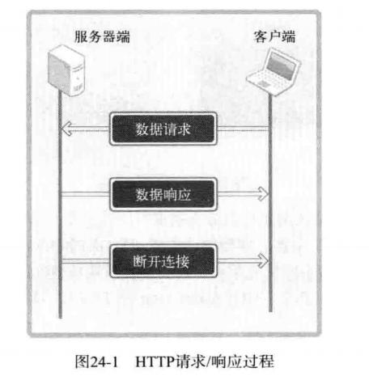
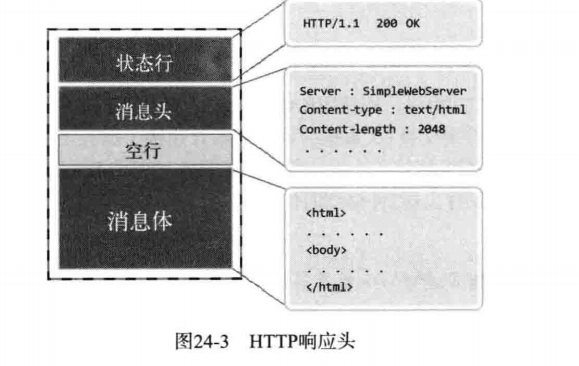
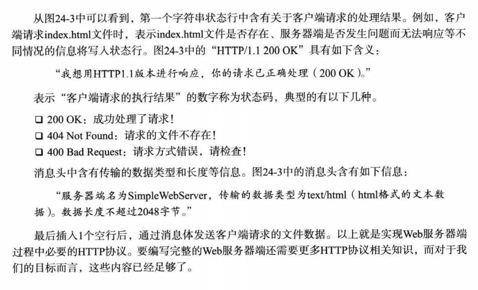
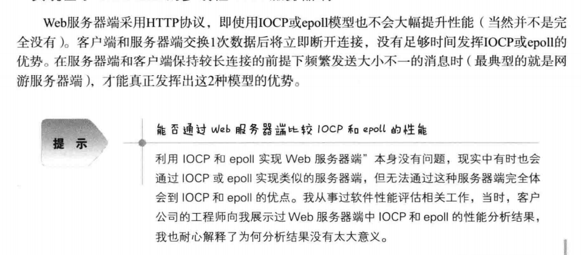
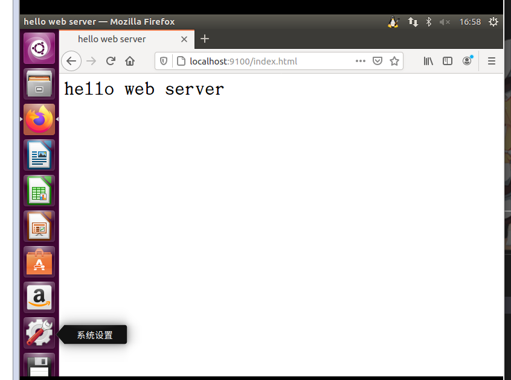

# 制作HTTP服务端

Web服务器端：基于HTTP协议将网页对应文件传输给客户端的服务器端

HTTP协议基于TCP/IP协议实现，是以超文本传输为目的而设计的应用层协议

## HTTP

### 无状态的Stateless协议

HTTP协议的请求及响应方式设计如图：


服务端响应客户端的请求之后立即断开连接，服务端不会维持客户端状态，即使客户端再次发送请求，服务器端也无法辨认出

保持状态的功能都是由Cookie和Session技术实现的

### 请求消息的结构


请求行包含请求方式（目的）GET用于请求数据,POST用于传输数据

请求行只能通过一行发送

消息头包含发送请求的浏览器信息，用户认证信息你，消息体中装有客户端向服务端传输的数据，为了装入数据，需要以POST方式发送请求

消息体和消息头之间用空行隔开，所以不会发生边界问题

### 响应消息的结构





## 实现简单的Web服务器端



## 基于Linux的多线程Web服务器端

```c
#include<stdio.h>
#include<stdlib.h>
#include<unistd.h>
#include<string.h>
#include<arpa/inet.h>
#include<sys/socket.h>
#include<pthread.h>


#define BUF_SIZE 1024
#define SMALL_BUF 100

char* content_type(char* file){
    char extension[SMALL_BUF];
    char file_name[SMALL_BUF];
    strcpy(file_name,file);
    strtok(file_name,".");
    strcpy(extension,strtok(NULL,"."));
    puts(extension);    
    if(!strcmp(extension,"html")||!strcmp(extension,"htm")){
        return "text/html";
    }
    else{
        return "text/plain";
    }
}


void send_error(FILE* fp){
    char protocol[] = "HTTP/1.0 400 Bad Request\r\n";
    char server[] = "Server:Linux Web Server\r\n";
    char cnt_len[] = "Content-length:2048\r\n";
    char cnt_type[] = "Content-type:text/html\r\n\r\n";
    char content[] = "<html><head><title>NETWORK</title></head>"
    "<body><font size=+5><br>发生错误！查看请求文件名和请求方式!"
    "</font></body></html>";
    fputs(protocol,fp);
    fputs(server,fp);
    fputs(cnt_len,fp);
    fputs(cnt_type,fp);
    fflush(fp);

}

void send_data(FILE* fp,char* ct,char* file_name){
    char protocol[] = "HTTP/1.0 200 OK\r\n";
    char server[] = "Server:Linux Web Server \r\n";
    char cnt_len[] = "Content-length:2048\r\n";
    char buf[BUF_SIZE];
    char cnt_type[SMALL_BUF];
    FILE* send_file;
    sprintf(cnt_type,"Content-type:%s\r\n\r\n",ct);
    send_file = fopen(file_name,"r");
    if(send_file==NULL){
        send_error(fp);
        return;
    } 
    //传输头信息
    fputs(protocol,fp);
    fputs(server,fp);
    fputs(cnt_len,fp);
    fputs(cnt_type,fp);
    //传输请求数据
    while(fgets(buf,BUF_SIZE,send_file)!=NULL){
        fputs(buf,fp);
        fflush(fp);

    }
    fflush(fp);
    fclose(fp);

}


void* request_handler(void *arg){
    int clnt_sock = *((int*)arg);
    char req_line[SMALL_BUF];
    FILE* clnt_read;
    FILE* clnt_write;
    char method[10];
    char ct[15];
    char file_name[30];

    clnt_read = fdopen(clnt_sock,"r");
    clnt_write = fdopen(dup(clnt_sock),"w");
    fgets(req_line,SMALL_BUF,clnt_read);
    if(strstr(req_line,"HTTP/")==NULL){
        // C 库函数 char *strstr(const char *haystack, const char *needle) 在字符串 haystack 中查找第一次出现字符串 needle 的位置，不包含终止符 '\0'。
        // 该函数返回在 haystack 中第一次出现 needle 字符串的位置，如果未找到则返回 null。
        send_error(clnt_write);
        fclose(clnt_read);
        fclose(clnt_write);
        return;


    }
    strcpy(method,strtok(req_line," /"));
    strcpy(file_name,strtok(NULL," /"));
    strcpy(ct,content_type(file_name));
    if(strcmp(method,"GET")!=0){
        send_error(clnt_write);
        fclose(clnt_read);
        fclose(clnt_write);
        return;
    }
    fclose(clnt_read);
    send_data(clnt_write,ct,file_name);

}


void error_handling(char* message){
    fputs(message,stderr);
    fputc('\n',stderr);
    exit(1);
}


int main(int argc,char* argv[]){

    int serv_sock,clnt_sock;
    struct sockaddr_in serv_adr,clnt_adr;
    socklen_t clnt_adr_size;
    char buf[BUF_SIZE];
    pthread_t t_id;
    if(argc!=2){
        printf("Usage:%s <port>\n",argv[0]);
        exit(1);
    }
    serv_sock = socket(PF_INET,SOCK_STREAM,0);
    memset(&serv_adr,0,sizeof(serv_adr));
    serv_adr.sin_family = AF_INET;
    serv_adr.sin_port = htons(atoi(argv[1]));
    serv_adr.sin_addr.s_addr = htonl(INADDR_ANY);

    if(bind(serv_sock,(struct sockaddr*)&serv_adr,sizeof(serv_adr))==-1){
        error_handling("bind error\n");
    }
    if(listen(serv_sock,20)==-1){
        error_handling("listen() error");
    }
    while(1){
        clnt_adr_size = sizeof(clnt_adr);
        clnt_sock = accept(serv_sock,(struct sockaddr*)&clnt_adr,&clnt_adr_size);
        printf("Connection Request:%s:%d\n",inet_ntoa(clnt_adr.sin_addr),ntohs(clnt_adr.sin_port));
        pthread_create(&t_id,NULL,request_handler,&clnt_sock);
        pthread_detach(t_id);

    }
    close(serv_sock);
    return 0;
}
```



```html
<title>
    hello web server
</title>

<h1>
    hello web server
</h1>
```

