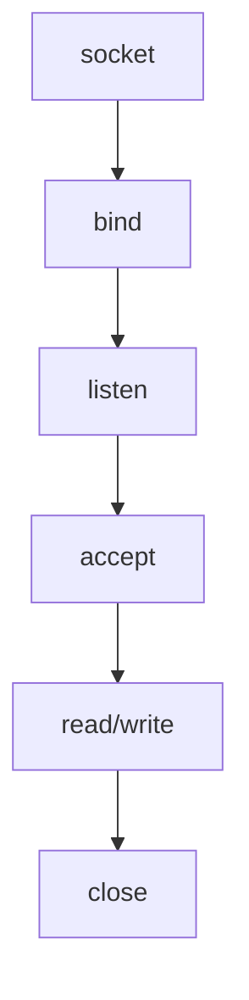
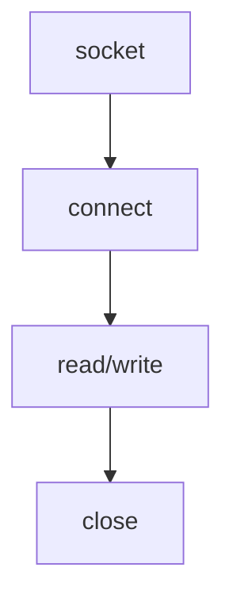

# TCP

TCP socket是面向连接的，因此又称基于stream

TCP/IP协议栈有四层：


IP本身是面向消息的，不可靠的协议，无法应对数据错误（数据的丢失/错误）

IP层解决数据传输中的路径选择问题

TCP保证可靠的数据传输，向不可靠的IP协议提供可靠性

应用层协议：根据程序特点决定服务器端和客户端之间的数据传输规则


## 实现基于TCP的服务器端和客户端

### 服务器端

函数调用顺序：



```c++
#include<sys/socket.h>
int listen(int sock,int backlog);
//成功返回0，失败返回-1
//sock：希望进入等待连接请求状态的socket，成为监听socket（服务端socket）
//backlog：连接请求等待队列的长度
```

服务端socket是用作门卫来受理连接请求的

所以数据的I/O还需要其他的socket

```c++
#include<sys/socket.h>
int accept(int sock,struct sockaddr* addr,socklen_t* addrlen);
//成功返回创建的socket文件描述符，失败返回-1
```

调用accept函数受理连接，并生成socket

## TCP客户端：



客户端使用connect发送连接请求

```c++
   #include <sys/types.h>          /* See NOTES */
   #include <sys/socket.h>

   int connect(int sockfd, const struct sockaddr *addr,
               socklen_t addrlen);
//sock，客户端socket文件描述符
//servaddr，为目标服务器地址
//addrlen，字节为单位的第二个结构体参数的地址变量长度
```
发生以下情况此函数才会返回

（1）服务器端接收连接请求

（2）发生断网等异常情况而中断连接请求

接收连接不是服务器端调用connect，而是服务器端将连接请求信息记录到等待队列

因此connect函数返回后并不立即进行数据交换

客户端的IP地址和端口在调用connect函数时自动分配，无需调用标记的bind函数进行分配。


实现echo服务端/客户端

```c++
#include<iostream>
#include<sys/socket.h>
#include<arpa/inet.h>
#include<unistd.h>
#include<stdlib.h>
#include<stdio.h>
#include<string.h>


// socket函数创建socket

// bind函数为socket分配ip地址和端口号

// listen函数将socket转换为可接收链接的状态


// accept函数用于接收对方的连接请求

//服务端同一时刻只与一个客户端相连
// 依次与五个客户端通信
#define BUFSIZE 1024

void error_handling(char *message);

int main(int argc,char *argv[]){

    int serv_sock;
    sockaddr_in serv_addr;
    char message[] = "hello world!";
    if(argc!=2){
        printf("Usage:%s <port>",argv[0]);//打印使用方法
        exit(1);
    }
    serv_sock = socket(PF_INET,SOCK_STREAM,0);
    if(serv_sock==-1){
        error_handling("socket() error");
    }
// 指定ip地址和端口号和ip协议族
    memset(&serv_addr,0,sizeof(serv_addr));
    serv_addr.sin_family = AF_INET;
    serv_addr.sin_addr.s_addr = htonl(INADDR_ANY);
    serv_addr.sin_port = htons(atoi(argv[1]));
    if(bind(serv_sock,(struct sockaddr*)&serv_addr,sizeof(serv_addr))==-1){
        error_handling("bind() error");
    }
    if(listen(serv_sock,5)==-1){
        error_handling("listen() error");
    }
    int str_len;
    int clnt_sock;
    sockaddr_in clnt_addr;
    socklen_t clint_addr_size;

    //五个客户端则要生成五个用于I/O的socket
    //使用循环
    // 要实现echo则在每次循环中使用while，一直接收和发送信息，直到用户输入q（quit）
    for(int i = 0;i<5;i++){

        clint_addr_size = sizeof(clnt_addr);
        clnt_sock=accept(serv_sock,(struct sockaddr*)&clnt_addr,&clint_addr_size);

        if(clnt_sock==-1){
            error_handling("accept() error");
        }
        else printf("Connected client %d\n",i+1);
        while ((str_len=read(clnt_sock,message,BUFSIZE))!=0)//注意加括号，防止优先级错误
        {
                        printf("lens:%d",str_len);

            printf("server :%s",message);
            write(clnt_sock,message,str_len);//原封不动的传送回去数据，因此使用str_len
        }
        
        close(clnt_sock);
    }
    close(serv_sock);
    return 0;
}
void error_handling(char *message){
    fputs(message,stderr);
    fputc('\n',stderr);
    exit(1);
}
```


```c++
#include<iostream>
#include<sys/socket.h>
#include<arpa/inet.h>
#include<unistd.h>
#include<stdlib.h>
#include<stdio.h>
#include<string.h>

#define BUF_SIZE 1024
void error_handling(char *message);

// connect()请求连接函数


int main(int argc,char* argv[]){
    int sock;
    sockaddr_in serv_addr;
    char message[30];
    int str_len;

    if(argc!=3){
        printf("Usage:%s<ip> <port>\n",argv[0]);
        exit(1);
    }

    sock = socket(PF_INET,SOCK_STREAM,0);
    if(sock==-1){
        error_handling("socket() error");
    }

    memset(&serv_addr,0,sizeof(serv_addr));
    serv_addr.sin_family = AF_INET;
    serv_addr.sin_addr.s_addr = inet_addr(argv[1]);
    serv_addr.sin_port = htons(atoi(argv[2]));

    if(connect(sock,(struct sockaddr*)&serv_addr,sizeof(serv_addr))==-1){
        error_handling("connect() error");
    }
    else
        puts("Connected.........");
    while (1)//实现echo，使用循环，直到用户输入q位置都一直收发信息
    {
        fputs("Input message(Q/q to quit):",stdout);
        fgets(message,BUF_SIZE,stdin);
        if(!strcmp(message,"q\n")||!strcmp(message,"Q\n")){
            break;
        }
        printf("%s\n",message);
        write(sock,message,strlen(message));
        str_len = read(sock,message,BUF_SIZE-1);
        message[str_len] = 0;

        printf("Message from server:%s\n",message);
    }
    
    // str_len = read(sock,message,sizeof(message)-1);
    // if(str_len==-1){
    //     error_handling("read() error!");
    // }

    // printf("Message from server: %s\n",message);
    close(sock);
    return 0;
}
void error_handling(char *message){
    fputs(message,stderr);
    fputc('\n',stderr);
    exit(1);
}
```


TCP不存在数据边界，多次write可能会一次性被传输到服务器端

也可能字符串过长，被分为几个包

## 完善echo客户端

解决以上代码可能出现的问题：

提前确定接收数据的大小，若之前传输了20字节的字符串，则接收时循环调用read函数读取20额字节的数据

```c++
#include<iostream>
#include<sys/socket.h>
#include<arpa/inet.h>
#include<unistd.h>
#include<stdlib.h>
#include<stdio.h>
#include<string.h>

#define BUF_SIZE 1024
void error_handling(char *message);

// connect()请求连接函数


int main(int argc,char* argv[]){
    int sock;
    sockaddr_in serv_addr;
    char message[30];
    int str_len;

    if(argc!=3){
        printf("Usage:%s<ip> <port>\n",argv[0]);
        exit(1);
    }

    sock = socket(PF_INET,SOCK_STREAM,0);
    if(sock==-1){
        error_handling("socket() error");
    }

    memset(&serv_addr,0,sizeof(serv_addr));
    serv_addr.sin_family = AF_INET;
    serv_addr.sin_addr.s_addr = inet_addr(argv[1]);
    serv_addr.sin_port = htons(atoi(argv[2]));

    if(connect(sock,(struct sockaddr*)&serv_addr,sizeof(serv_addr))==-1){
        error_handling("connect() error");
    }
    else
        puts("Connected.........");
    while (1)//实现echo，使用循环，直到用户输入q位置都一直收发信息
    {
        fputs("Input message(Q/q to quit):",stdout);
        fgets(message,BUF_SIZE,stdin);
        if(!strcmp(message,"q\n")||!strcmp(message,"Q\n")){
            break;
        }
        printf("%s\n",message);
        str_len = write(sock,message,strlen(message));
        // str_len = read(sock,message,BUF_SIZE-1);
        int recv_len = 0;
        int recv_cnt;
        while (recv_len<str_len)
        {
            recv_cnt = read(sock,&message[recv_len],BUF_SIZE-1);
            if(recv_cnt==-1)
                error_handling("read() error");
            recv_len+=recv_cnt;
             
        }
        
        message[str_len] = 0;

        printf("Message from server:%s\n",message);
    }
    // str_len = read(sock,message,sizeof(message)-1);
    // if(str_len==-1){
    //     error_handling("read() error!");
    // }
    // printf("Message from server: %s\n",message);
    close(sock);
    return 0;
}
void error_handling(char *message){
    fputs(message,stderr);
    fputc('\n',stderr);
    exit(1);
}
```

## 定义应用层协议：

```c++
   for(i = 0;i<opnd_cnt;i++){
        printf("Operand %d:",i+1);
        scanf("%d",(int*)&opmsg[i*OPSZ+1]);
        cout<<i*OPSZ+1<<":"<<*(int*)&opmsg[i*OPSZ+1]<<endl;
        cout<<*&opmsg[i]<<endl;//输出为空字符
    }
```

**???**

**此处4字节int型数据保存到char数组，转换为int指针类型的原理？**

```c++
#include<iostream>
#include<stdio.h>
#include<stdlib.h>
#include<string.h>
#include<unistd.h>
#include<fcntl.h>
#include<sys/socket.h>
#include<sys/types.h>
#include<arpa/inet.h>

using namespace std;

#define OPSZ 4
#define READ_ANSWER_SIZE 4
#define BUF_SIZE 1024


void error_handling(char *message){
    fputs(message,stderr);
    fputc('\n',stderr);
    exit(1);
}

int main(int argc,char* argv[])
{
    int sock;
    char opmsg[BUF_SIZE];
    int result,op_cnt,i;

    struct sockaddr_in serv_add;
    if(argc!=3){
        printf("Usage : %s <IP> <port>\n",argv[0]);//如果命令行参数不够三个，则输出正确的使用方法提示并退出
        exit(1);
    }
    sock = socket(PF_INET,SOCK_STREAM,0);//用于连接的socket

    if(sock==-1){
        error_handling("socket() error");
    }
    //分配内存,以便为其赋值之后强制类型转换
    memset(&serv_add,0,sizeof(serv_add));
    serv_add.sin_addr.s_addr = inet_addr(argv[1]);//ip地址且转换为网络字节序的整数类型
    serv_add.sin_port = htons(atoi(argv[2]));
    serv_add.sin_family = AF_INET;
    //内存大小相同才能完美的强制转换
    if(connect(sock,(struct sockaddr*)&serv_add,sizeof(serv_add))==-1){
        error_handling("connect() error");
    }
    else{
        puts("Connected.............");

    }
    // fputs("count:",stdout);
    // scanf("%d",&op_cnt);
    // opmsg[0] = (char)op_cnt;
    // for(i = 0;i<op_cnt;i++){
    //     printf("Operand %d:",i+1);
    //     scanf("%d",(int*)&opmsg[i*OPSZ]+1);//将opmsg对应数字的首地址转换为int指针型
    // }
    // fgetc(stdin);//使用此函数删除缓冲中的字符\n
    // fputs("Operator:",stdout);
    // scanf("%c",&opmsg[OPSZ*op_cnt+1]);
    // write(sock,opmsg,op_cnt*OPSZ+2);

    // read(sock,&result,READ_ANSWER_SIZE);
    // printf("result:%d\n",result);
    // close(sock);
    //是这里出了问题导致result不正确
        fputs("Operand count: ", stdout);
        int opnd_cnt;
    scanf("%d", &opnd_cnt);
    opmsg[0] = (char)opnd_cnt;

    for (i = 0; i < opnd_cnt; i++)
    {
        printf("Operand %d: ", i + 1);
        scanf("%d", (int *)&opmsg[i * OPSZ + 1]);//这句话在上面写错了
    }
    fgetc(stdin);
    fputs("Operator: ", stdout);
    scanf("%c", &opmsg[opnd_cnt * OPSZ + 1]);
    write(sock, opmsg, opnd_cnt * OPSZ + 2);
    read(sock, &result, 4);

    printf("Operation result: %d \n", result);
    close(sock);
    return 0;

    return 0;
}
```

```c++
#include<iostream>
#include<stdio.h>
#include<stdlib.h>
#include<string.h>
#include<unistd.h>
#include<fcntl.h>
#include<sys/socket.h>
#include<sys/types.h>
#include<arpa/inet.h>


#define OPSZ 4
#define READ_ANSWER_SIZE 4
#define BUF_SIZE 1024

using namespace std;

void error_handling(char *message){
    fputs(message,stderr);
    fputc('\n',stderr);
    exit(1);
}

// int calculate(int opnum,int opnds[],char op){
//     int result = opnds[0],i;
//     switch (op)
//     {
//     case '+':
//         for(i = 1;i<opnum;i++){
//             result+=opnds[i];
//         }
//         break;
//     case '-':
//         for(i = 1;i<opnum;i++){
//             result-=opnds[i];
//         }
//         break;   
//     case '*':
//         for(i = 1;i<opnum;i++){
//             result*=opnds[i];
//         }
//         break;   
//     }
//     return result;

// }
//也不是这里
int calculate(int opnum, int opnds[], char op)
{
    int result = opnds[0], i;
    switch (op)
    {
    case '+':
        for (i = 1; i < opnum; i++)
            result += opnds[i];
        break;
    case '-':
        for (i = 1; i < opnum; i++)
            result -= opnds[i];
        break;
    case '*':
        for (i = 1; i < opnum; i++)
            result *= opnds[i];
        break;
    }
    return result;
}

int main(int argc,char * argv[]){


    int serv_sock,op_cnt;
    sockaddr_in serv_addr;
    if(argc!=2){
        printf("Usage:%s <port>",argv[0]);//打印使用方法
        exit(1);
    }
    serv_sock = socket(PF_INET,SOCK_STREAM,0);
    if(serv_sock==-1){
        error_handling("socket() error");
    }
// 指定ip地址和端口号和ip协议族
    memset(&serv_addr,0,sizeof(serv_addr));
    serv_addr.sin_family = AF_INET;
    serv_addr.sin_addr.s_addr = htonl(INADDR_ANY);
    serv_addr.sin_port = htons(atoi(argv[1]));
    if(bind(serv_sock,(struct sockaddr*)&serv_addr,sizeof(serv_addr))==-1){
        error_handling("bind() error");
    }
    if(listen(serv_sock,5)==-1){
        error_handling("listen() error");
    }
    int recv_len,recv_cnt;
    int clnt_sock;
    sockaddr_in clnt_adr;
    socklen_t clnt_adr_sz;
    int result;
    clnt_adr_sz = sizeof(clnt_adr);
    char opinfo[BUF_SIZE];
    //不是这里出的问题
        // op_cnt = 0;
        // clnt_sock = accept(serv_sock,(struct sockaddr*)&clnt_addr,&clint_addr_size);
        // read(clnt_sock,&op_cnt,1);
        // // cout<<op_cnt<<endl;
        // recv_len = 0;
        // while((op_cnt*OPSZ+1)>recv_len){//这里的条件是到recv_len==op_cnt*OPSZ+1则退出循环是因为while循环之外已经读取了一个op_cnt(1字节)
        // // 所以相加还是op_cnt*OPSZ+2字节
        //     recv_cnt = read(clnt_sock,&opinfo[recv_len],BUF_SIZE-1);//为什么要-1？？？
        //     // cout<<*(int*)&opinfo[recv_len]<<endl;
        //     recv_len += recv_cnt;
        // }

        // result = calculate(op_cnt,(int*)opinfo,opinfo[recv_len-1]);
        // // cout<<result<<endl;
        // write(clnt_sock,(char*)&result,sizeof(result));
        // close(clnt_sock);
        int opnd_cnt;
        opnd_cnt = 0;
        clnt_sock = accept(serv_sock, (struct sockaddr *)&clnt_adr, &clnt_adr_sz);
        read(clnt_sock, &opnd_cnt, 1);

        recv_len = 0;
        while ((opnd_cnt * OPSZ + 1) > recv_len)
        {
            recv_cnt = read(clnt_sock, &opinfo[recv_len], BUF_SIZE - 1);
            recv_len += recv_cnt;
        }
        result = calculate(opnd_cnt, (int *)opinfo, opinfo[recv_len - 1]);
        write(clnt_sock, (char *)&result, sizeof(result));
        close(clnt_sock);

    close(serv_sock);

    return 0;
}
```

