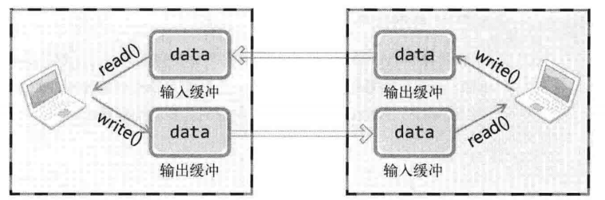
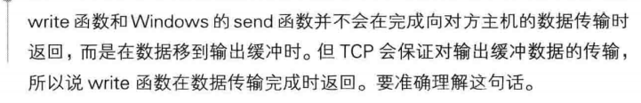

# TCP原理

TCP socket的数据收发是没有边界的，所以发送不一定一次全部全送，接收也不一定一次全部接收

例如调用1次write函数发送10字节数据，那客户端可能调用n次read函数每次读取若干字节

这一现象的背后发生的事儿：

write调用后不立即传输数据，read调用也不立即接收数据

## TCP socket中的I/O缓冲：

**存在一个缓冲区，本机调用write，数据发送至本机的输出缓冲区，在某一时间时传入对方的输入缓冲，对方调用read从，从输入缓冲区读出数据**

I/O缓冲的特性：

- 在每个TCP socket中单独存在
- 创建socket时自动生成
- socket关闭后，会继续传递输出缓冲中的遗留数据
- socket关闭后，将丢失输入缓冲中的数据

**注意TCP socket不会发生一次传输数据大小超过输入缓冲大小的情况**

**例如客户端输入缓冲区为50字节，服务器端传输了100字节**

TCP会控制数据流，有滑动窗口协议，因此TCP中不会出现因缓冲溢出而丢失数据的情况

