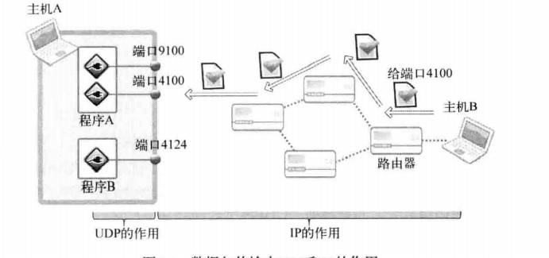
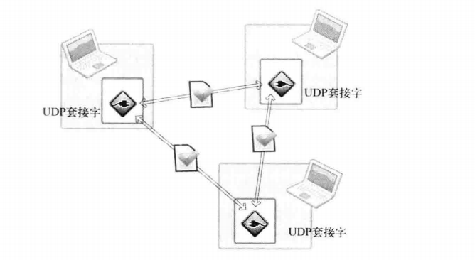
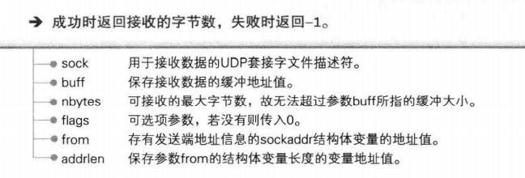
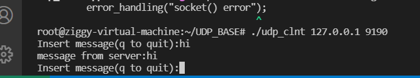

# UDP

## 1. UDP socket 的特点

UDP提供的是不可靠的传输方式，性能相比TCP可能会更好（有些情况），实现更简单

UDP和TCP的差异：
UDP不提供流控制机制，TCP的生命在于流控制，与对方socket连接和断开的过程也属于流控制的一部分

TCP的速度一般比UDP慢，每次交换的数据量越大，TCP的传输速率越接近UDP

## 2. UDP工作原理



IP的作用是让离开主机B的UDP数据包准确的传递到主机A，但是把UDP包交给A的某一UDP socket是UDP完成的

UDP常用于实时传输视频，音频

为什么TCP会比UDP慢：

（1）收发数据前后进行的连接设置和清除过程

（2）可靠性的流控制的添加

## UDP实现的客户端/服务端

UDP无需经过连接过程，只有创建socket和数据交换

```c++
//UDP 服务器和客户端都只需要一个socket

// TCP中服务端socket与客户端是一对一关系
// 与10个客户端收发数据，则负责传送数据的服务端socket要10个

// 只需一个UDP socket即可向任意主机传送数据
```



```c++
   ssize_t sendto(int sockfd, const void *buf, size_t len, int flags,
                  const struct sockaddr *dest_addr, socklen_t addrlen);

//sock UDP socket文件描述符
//buff 保存待传输数据的缓冲地址值
//nbytes 待传输的数据长度，以字节为单位
//flags 可选项参数，没有则传递0
//to，目标地址的sockaddr结构体变量的地址
//addrlen 地址值的结构体变量长度

//成功则返回传输的字节数，失败返回-1
```
```c++

       ssize_t recvfrom(int sockfd, void *buf, size_t len, int flags,
                        struct sockaddr *src_addr, socklen_t *addrlen);

```




```c++
//udp_clnt.cpp
#include<iostream>
#include<stdio.h>
#include<stdlib.h>
#include<string.h>
#include<unistd.h>
#include<fcntl.h>
#include<sys/socket.h>
#include<sys/types.h>
#include<arpa/inet.h>

using namespace std;

//UDP 服务器和客户端都只需要一个socket

// TCP中服务端socket与客户端是一对一关系
// 与10个客户端收发数据，则负责传送数据的服务端socket要10个

// 只需一个UDP socket即可向任意主机传送数据


#define BUF_SIZE 30


void error_handling(char *message){
    fputs(message,stderr);
    fputc('\n',stderr);
    exit(1);
}

int main(int argc,char* argv[])
{
    int sock;
    char message[BUF_SIZE];

    int str_len;
    socklen_t adr_sz;

    struct sockaddr_in serv_adr,from_adr;
    if(argc!=3){
        printf("Usage:%s <IP> <port>\n",argv[0]);
        exit(1);
    }

    sock = socket(PF_INET,SOCK_DGRAM,0);

    if(sock==-1){
        error_handling("socket() error");
    }

    memset(&serv_adr,0,sizeof(serv_adr));
    serv_adr.sin_addr.s_addr = inet_addr(argv[1]);
    serv_adr.sin_family = AF_INET;
    serv_adr.sin_port = htons(atoi(argv[2]));

    while(1){
        fputs("Insert message(q to quit):",stdout);
        fgets(message,sizeof(message),stdin);
        if(!strcmp(message,"q\n")||!strcmp(message,"Q\n"))
            break;
        
        sendto(sock,message,strlen(message),0,(struct sockaddr*)&serv_adr,sizeof(serv_adr));
        adr_sz = sizeof(from_adr);
    //这里的from_adr有什么用？？？？
    
        str_len = recvfrom(sock,message,BUF_SIZE,0,(struct sockaddr*)&from_adr,&adr_sz);
        message[str_len] = 0;
        printf("message from server:%s",message);
    }
    close(sock);

    return 0;
}
```

```c++
//udp_server.cpp
#include<iostream>
#include<stdio.h>
#include<stdlib.h>
#include<string.h>
#include<unistd.h>
#include<fcntl.h>
#include<sys/socket.h>
#include<sys/types.h>
#include<arpa/inet.h>

using namespace std;

//UDP 服务器和客户端都只需要一个socket

// TCP中服务端socket与客户端是一对一关系
// 与10个客户端收发数据，则负责传送数据的服务端socket要10个

// 只需一个UDP socket即可向任意主机传送数据


#define BUF_SIZE 30


void error_handling(char *message){
    fputs(message,stderr);
    fputc('\n',stderr);
    exit(1);
}

int main(int argc,char* argv[])
{
    int serv_sock;
    char message[BUF_SIZE];
    int str_len;

    socklen_t clnt_ad_sz;
    struct sockaddr_in serv_adr,clnt_adr;
    if(argc!=2){
        printf("Usage : %s <port>\n",argv[0]);
        exit(1);
    }
    serv_sock = socket(PF_INET,SOCK_DGRAM,0);
    if(serv_sock==-1){
        error_handling("UDP socket creation error");
    }

    memset(&serv_adr,0,sizeof(serv_adr));
    serv_adr.sin_addr.s_addr = htonl(INADDR_ANY);
    serv_adr.sin_port = htons(atoi(argv[1]));
    serv_adr.sin_family  = AF_INET;

    if(bind(serv_sock,(struct sockaddr*)&serv_adr,sizeof(serv_adr))==-1){
        error_handling("bind() error");
    }

    while(1){
        clnt_ad_sz = sizeof(clnt_adr);
        str_len = recvfrom(serv_sock,message,BUF_SIZE,0,(struct sockaddr
        *)&clnt_adr,&clnt_ad_sz);//通过此函数获得数据传输端的地址（clnt_adr）
        

        sendto(serv_sock,message,str_len,0,(struct sockaddr*)&clnt_adr
        ,clnt_ad_sz);
        //接收客户端发来的数据，按原样内容和大小返回

    }
    close(serv_sock);

    return 0;
}
```



bind函数不区分TCP/UDP

所以都可以调用

sento函数在调用时自动分配IP和端口号


## UDP的数据传输特性

UDP是具有数边界的协议，所以要注意I/O函数的调用次数

输入函数和输出函数的调用次数要完全一致

```c++
#include<iostream>
#include<stdio.h>
#include<stdlib.h>
#include<string.h>
#include<unistd.h>
#include<fcntl.h>
#include<sys/socket.h>
#include<sys/types.h>
#include<arpa/inet.h>
#define BUF_SIZE 30


//服务端

int main(int argc,char* argv[])
{   
    int sock;
    char message[BUF_SIZE];
   struct sockaddr_in my_adr,your_adr;

    socklen_t adr_sz;
    int str_len;

    sock = socket(PF_INET,SOCK_DGRAM,0);

    memset(&my_adr,0,sizeof(my_adr));

    my_adr.sin_family = AF_INET;
    my_adr.sin_addr.s_addr = htonl(INADDR_ANY);
    my_adr.sin_port = htons(atoi(argv[1]));

    bind(sock,(struct sockaddr*)&my_adr,sizeof(my_adr));

    for(int i = 0;i<3;i++){
        sleep(5);
        adr_sz = sizeof(your_adr);
        str_len = recvfrom(sock,message,BUF_SIZE,0,(struct sockaddr*)&your_adr,&adr_sz);
        printf("message:%d : %s\n",i+1,message);
//your_adr有什么用？？？？
    }
    close(sock);
    return 0;

}
```

```c++
#include<iostream>
#include<stdio.h>
#include<stdlib.h>
#include<string.h>
#include<unistd.h>
#include<fcntl.h>
#include<sys/socket.h>
#include<sys/types.h>
#include<arpa/inet.h>
#define BUF_SIZE 30


//服务端

int main(int argc,char* argv[])
{   
    int sock;
    char msg1[] = "hi";
    char msg2[] = "i'm another udp host!";
    char msg3[] = "nice to meet you";


    struct sockaddr_in your_adr;

    socklen_t adr_sz;
    int str_len;

    sock = socket(PF_INET,SOCK_DGRAM,0);

    memset(&your_adr,0,sizeof(your_adr));

    your_adr.sin_family = AF_INET;
    your_adr.sin_addr.s_addr = inet_addr(argv[1]);
    your_adr.sin_port = htons(atoi(argv[2]));

    sendto(sock,msg1,sizeof(msg1),0,(struct sockaddr*)&your_adr,sizeof(your_adr));
    
    sendto(sock,msg2,sizeof(msg2),0,(struct sockaddr*)&your_adr,sizeof(your_adr));
    //这里的your_adr是干什么用的？？？？
    sendto(sock,msg3,sizeof(msg3),0,(struct sockaddr*)&your_adr,sizeof(your_adr));
    close(sock);
    return 0;

}
```

UDP传送的数据包又称为数据报（因为存在数据边界，一个数据包即为一个完整数据，因此可以称为数据报）

TCP sokcet要注册待传输数据的目标IP和端口号

sento传输过程分为三个阶段：
（1）向UDP socket 注册目标IP和端口号

（2）传输数据

（3）删除UDP socket中注册的目标地址信息

未注册目标地址信息的叫未连接socket，反之则为连接connected socket

UDP socket默认为未连接socket

如果与一个主机长时间通信，那么将UDP socket变为连接socket更好

例如：

```c++
//创建已连接的UDP socket
#include<iostream>
#include<stdio.h>
#include<stdlib.h>
#include<string.h>
#include<unistd.h>
#include<fcntl.h>
#include<sys/socket.h>
#include<sys/types.h>
#include<arpa/inet.h>

using namespace std;

#define BUF_SIZE 30


void error_handling(char *message){
    fputs(message,stderr);
    fputc('\n',stderr);
    exit(1);
}
int main(int argc,char* argv[])
{


    int sock;
    char message[BUF_SIZE];

    int str_len;
    socklen_t adr_sz;

    struct sockaddr_in serv_adr,from_adr;
    if(argc!=3){
        printf("Usage:%s <IP> <port>\n",argv[0]);
        exit(1);
    }

    sock = socket(PF_INET,SOCK_DGRAM,0);

    if(sock==-1){
        error_handling("socket() error");
    }

    memset(&serv_adr,0,sizeof(serv_adr));
    serv_adr.sin_addr.s_addr = inet_addr(argv[1]);
    serv_adr.sin_family = AF_INET;
    serv_adr.sin_port = htons(atoi(argv[2]));
    connect(sock,(struct sockaddr*)&serv_adr,sizeof(serv_adr));
    while(1){
        fputs("Insert message(q to quit):",stdout);
        fgets(message,sizeof(message),stdin);
        if(!strcmp(message,"q\n")||!strcmp(message,"Q\n"))
            break;
        
        // sendto(sock,message,strlen(message),0,(struct sockaddr*)&serv_adr,sizeof(serv_adr));
        // adr_sz = sizeof(from_adr);
    //这里的from_adr有什么用？？？？
        write(sock,message,strlen(message));
        // str_len = recvfrom(sock,message,BUF_SIZE,0,(struct sockaddr*)&from_adr,&adr_sz);
        // char message2[BUF_SIZE];

        // str_len = read(sock,message,sizeof(message)-1);
        
        str_len = read(sock,message,sizeof(message));
        //为什么要-1？？？
        /*


        cout<<from_adr.sin_addr.s_addr<<endl;
        message[str_len] = 0;
        Insert message(q to quit):hi
0
message from server:h
        */
               message[str_len] = 0;

        printf("message from server:%s",message);
    }
    close(sock);

    return 0;


    
//将UDP socket改为已连接的socket，只需调用connect函数

// 因为connect指定了收发的服务器对象，所以可以使用write和read进行通信了

}
```

