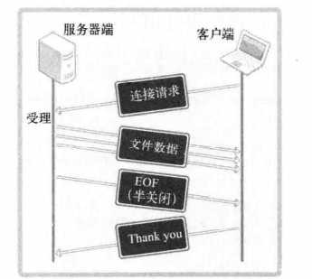

# TCP的半关闭

调用close函数是单方面断开的连接（完全断开连接）

完全断开后不仅仅不能传输数据，而且无法接收数据

两个主机建立了socket连接之后，每个主机拥有单独的输入和输出流

半关闭只断开其中一个流，而close同时断开两个流


```c++

//用于半关闭的函数：
int shutdown(int sock,int howto);

// sock:需要断开的socket文件描述符
// howto：传递断开方式
第二个参数：
SHUT_RD ： 断开输入流（无法接收数据，无法调用输入相关函数，输入缓冲中收到的数据也会删去）
SHUT_WR ： 断开输出流 （无法传输数据，但是输出缓冲中未传输完毕的数据，仍将传递至目标主机）
SHUT_RDWR ： 同时断开I/O流

```



```c++
//测试半关闭：
//server.cpp
#include<iostream>
#include<sys/socket.h>
#include<arpa/inet.h>
#include<unistd.h>
#include<stdlib.h>
#include<stdio.h>
#include<string.h>

using namespace std;

#define BUF_SIZE 30
// socket函数创建socket

// bind函数为socket分配ip地址和端口号

// listen函数将socket转换为可接收链接的状态


// accept函数用于接收对方的连接请求

void error_handling(char *message);

int main(int argc,char *argv[]){

    int serv_sock;
    FILE* fp;
   fp =  fopen("file_server.c","rb");//注意接收返回的文件描述符,不然在使用fp时会产生段错误

    sockaddr_in serv_addr;
    char buf[BUF_SIZE];

    if(argc!=2){
        printf("Usage:%s <port>",argv[0]);//打印使用方法
        exit(1);
    }
    serv_sock = socket(PF_INET,SOCK_STREAM,0);
    if(serv_sock==-1){
        error_handling("socket() error");
    }
// 指定ip地址和端口号和ip协议族
    memset(&serv_addr,0,sizeof(serv_addr));
    serv_addr.sin_family = AF_INET;
    serv_addr.sin_addr.s_addr = htonl(INADDR_ANY);
    serv_addr.sin_port = htons(atoi(argv[1]));
    if(bind(serv_sock,(struct sockaddr*)&serv_addr,sizeof(serv_addr))==-1){
        error_handling("bind() error");
    }
    if(listen(serv_sock,5)==-1){
        error_handling("listen() error");
    }

    int clnt_sock;
    sockaddr_in clnt_addr;
    socklen_t clint_addr_size;
    clint_addr_size = sizeof(clnt_addr);
    clnt_sock=accept(serv_sock,(struct sockaddr*)&clnt_addr,&clint_addr_size);
    if(clnt_sock==-1){
        error_handling("accept() error");
    }
    cout<<"hello"<<endl;
    int read_cnt;
    // write(clnt_sock,message,sizeof(message));
    while(1){
        read_cnt = fread((void*)buf,1,BUF_SIZE,fp);
        //如果字节数小于BUF_SIZE则全部write
        // 如果大于则在循环中多次直到小于
                    cout<<"yes"<<endl;

        if(read_cnt<BUF_SIZE){
            write(clnt_sock,buf,read_cnt);
            cout<<"yes"<<endl;
            break;
        }
        write(clnt_sock,buf,BUF_SIZE);


    }
    cout<<"hellow"<<endl;
    shutdown(clnt_sock,SHUT_WR);//只关闭输出流，所以依然可以接收数据
    read(clnt_sock,buf,BUF_SIZE);
    printf("message from client:%s\n",buf);

    fclose(fp);
    close(clnt_sock);
    close(serv_sock);
    return 0;
}
void error_handling(char *message){
    fputs(message,stderr);
    fputc('\n',stderr);
    exit(1);
}
```

```c++
//clent.cpp

/*
//用于半关闭的函数：
int shutdown(int sock,int howto);
// sock:需要断开的socket文件描述符
// howto：传递断开方式
第二个参数：
SHUT_RD ： 断开输入流（无法接收数据，无法调用输入相关函数，输入缓冲中收到的数据也会删去）
SHUT_WR ： 断开输出流 （无法传输数据，但是输出缓冲中未传输完毕的数据，仍将传递至目标主机）
SHUT_RDWR ： 同时断开I/O流
*/

#include<iostream>
#include<sys/socket.h>
#include<arpa/inet.h>
#include<unistd.h>
#include<stdlib.h>
#include<stdio.h>
#include<string.h>

#define BUF_SIZE 30

void error_handling(char *message);

// connect()请求连接函数


int main(int argc,char* argv[]){
    int sock;
    sockaddr_in serv_addr;
    char buf[BUF_SIZE];
    int str_len;
    int read_cnt;
    FILE* fp;
    fp = fopen("receive.dat","wb");

    if(argc!=3){
        printf("Usage:%s<ip> <port>\n",argv[0]);
        exit(1);
    }

    sock = socket(PF_INET,SOCK_STREAM,0);
    if(sock==-1){
        error_handling("socket() error");
    }

    memset(&serv_addr,0,sizeof(serv_addr));
    serv_addr.sin_family = AF_INET;
    serv_addr.sin_addr.s_addr = inet_addr(argv[1]);
    serv_addr.sin_port = htons(atoi(argv[2]));

    if(connect(sock,(struct sockaddr*)&serv_addr,sizeof(serv_addr))==-1){
        error_handling("connect() error");
    }

    while((read_cnt = read(sock,buf,BUF_SIZE))!=0){
        fwrite((void*)buf,1,read_cnt,fp);
    }
    puts("received file data");

    write(sock,"thank you",10);
    fclose(fp);
    close(sock);
    return 0;
}
void error_handling(char *message){
    fputs(message,stderr);
    fputc('\n',stderr);
    exit(1);
}
```

