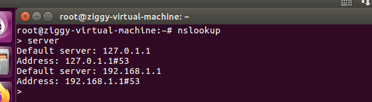
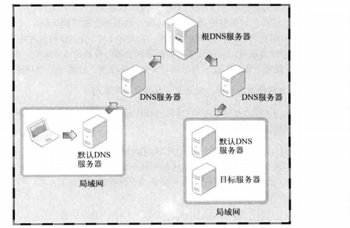
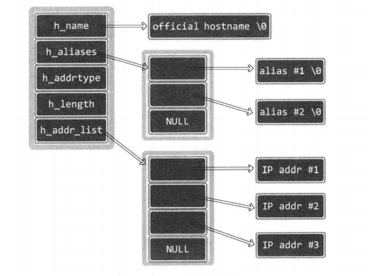
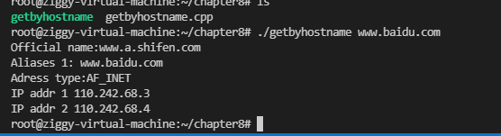
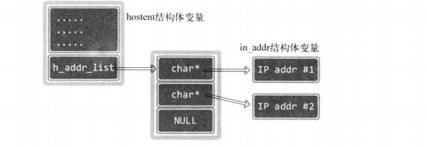

# 域名系统（DNS）

域名相比于IP地址，更易表述，记忆

在浏览器中输入IP地址访问网站和输入域名访问网站没什么区别

但是接入的过程不同，域名是一个赋予服务端的虚拟地址，所以接入过程中要将其转换为实际地址

DNS服务器担起了这个责任

主机中记录着默认DNS服务器地址，可以通过其来获得域名相应的IP地址信息

如何获取域名对应的IP地址？

`ping www.baidu.com`操作即可获得IP地址，这是因为在验证IP数据包是否能到达目的地时，会经过域名转换为IP地址的过程

查看主机注册的默认DNS服务器地址：
`nslookup`

(Linux系统需要再输入server)



默认的DNS服务器无法知道所有域名的IP，所以当无法解析时，会走以下流程：（询问其他DNS服务器）


得到IP地址后原路返回

域名的可变性比IP地址要低得多，所以使用域名编写程序更好一些

运行程序时，根据域名获取IP地址，再接入服务器，防止程序依赖于服务器IP地址

域名到IP地址的转换

```c++
  #include <netdb.h>
   extern int h_errno;

   struct hostent *gethostbyname(const char *name);
//传入域名字符串，返回hostent结构体

struct hostent{
    char* h_name;//官方域名
    char** h_aliases;//同一个IP可以绑定多个域名
    int h_addrtype;//gethostbyname也支持IPv6，可以通过此变量获取保存在h_addr_list的IP地址的地址族信息
    //如果是IPv4则保存有AF_INET
    int h_length;//IP地址长度
    char ** h_addr_list;//以整数形式保存域名对应的IP地址，一个域名也可能有多个IP地址
}
```


```c++
#include<unistd.h>
#include<stdio.h>
#include<stdlib.h>
#include<netdb.h>
#include<arpa/inet.h>


void error_handling(char *message){
    fputs(message,stderr);
    fputc('\n',stderr);
    exit(1);
}
int main(int argc,char* argv[])
{


    //通过域名来获取IP地址
    struct hostent* host =  gethostbyname("www.baidu.com");
    if(argc!=2){
        printf("Usage:....\n");
    }

    host = gethostbyname(argv[1]);
    //如果host为空指针
    if(!host){
        error_handling("gethost error");
    }
    printf("Official name:%s\n",host->h_name);

    // 可能有多个域名，所以用循环
    for(int i = 0;host->h_aliases[i];i++){
        //当host->aliases[i]为空时跳出循环
        printf("Aliases %d: %s\n",i+1,host->h_aliases[i]);
    }
    printf("Adress type:%s\n",(host->h_addrtype==AF_INET)?"AF_INET":"AF_INET6");
    for(int i = 0;host->h_addr_list[i];i++){
        //转换为in_addr结构体指针后再解引用
        printf("IP addr %d %s\n",i+1,(inet_ntoa(*(struct in_addr*)host->h_addr_list[i])));
    }
    return 0;
}
```



h_addr_list指向字符串指针数组，其中的元素指向的其实是in_addr结构体变量的地址而不是字符串



由于h_addr_list也可以保存IPv6地址信息，所以考虑到通用性，声明为了char指针型的数组

## 使用IP地址获取域名

```c++
#include<netdb.h>
struct hostent * gethostbyaddr(const char*addr,socklen_t len,int family);
//addr   含有IP地址信息的in_addr结构体指针,为了可以传递IPv4之外的其他信息，所以声明为char指针
//第一个参数传递地址信息的字节数，用于区分IPv4（4字节）,IPv6（16字节）
//family 传递地址族信息，IPv4：AF_INET,IPv6：AF_INET6
```

```c++
//此函数的用法：
#include<unistd.h>
#include<stdio.h>
#include<stdlib.h>
#include<netdb.h>
#include<arpa/inet.h>
#include<string.h>

void error_handling(char *message){
    fputs(message,stderr);
    fputc('\n',stderr);
    exit(1);
}
int main(int argc,char* argv[])
{


    //通过域名来获取IP地址
    struct sockaddr_in addr;
    
    struct hostent* host;
    if(argc!=2){
        printf("Usage:....\n");
    }

    memset(&addr,0,sizeof(addr));
    addr.sin_addr.s_addr = inet_addr(argv[1]);

    host = gethostbyaddr((char*)&addr.sin_addr,4,AF_INET);

    //如果host为空
    if(!host){
        error_handling("gethost error");
    }
    printf("Official name:%s\n",host->h_name);

    // 可能有多个域名，所以用循环
    for(int i = 0;host->h_aliases[i];i++){
        //当host->aliases[i]为空时跳出循环
        printf("Aliases %d: %s\n",i+1,host->h_aliases[i]);
    }
    printf("Adress type:%s\n",(host->h_addrtype==AF_INET)?"AF_INET":"AF_INET6");
    for(int i = 0;host->h_addr_list[i];i++){
        //转换为in_addr结构体指针后再解引用
        printf("IP addr %d %s\n",i+1,(inet_ntoa(*(struct in_addr*)host->h_addr_list[i])));
    }
    return 0;
}
```

