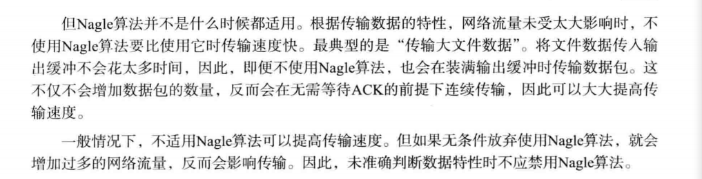

# 套接字的多种可选项


socket的可选项是分层的（IP协议，TCP,通用可选项）


```c++
#include<stdio.h>
#include<stdlib.h>
#include<unistd.h>
#include<sys/socket.h>

void error_handling(char *message)
{
    fputs(message, stderr);
    fputc('\n', stderr);
    exit(1);
}

int main(int argc,char* argv[])
{
    //使用getsockopt读取socket的可选项
    // 用SOL_SOCKET,SP_TYPE的可选项查看套接字类型(tcp或udp)
    int tcp_sock,udp_sock;
    int sock_type;
    socklen_t optlen;
    int state;
    optlen = sizeof(sock_type);
    tcp_sock = socket(PF_INET,SOCK_STREAM,0);
    udp_sock = socket(PF_INET,SOCK_DGRAM,0);
    printf("SOCK_STREAM:%d\n",SOCK_STREAM);
    printf("SOCK_STREAM:%d\n",SOCK_DGRAM);

    state = getsockopt(tcp_sock,SOL_SOCKET,SO_TYPE,(void*)&sock_type,&optlen);

    if(state){
        error_handling("getsockopt() error");
    }
    printf("Socket type one :%d\n",sock_type);
    state = getsockopt(udp_sock,SOL_SOCKET,SO_TYPE,(void*)&sock_type,&optlen);
    if(state){
        error_handling("getsockopt() error");
    }
    printf("type two:%d\n",sock_type);

    return 0;
}
```


## SO_SNDBUF & SO_RCVBUF

创建socket将同时生成I/O缓冲

SO_SNDBUF & SO_RCVBUF分别是输出缓冲大小可选项，输入缓冲大小可选项

### 可以读取当前缓冲大小也可以更改缓冲大小

```c++
#include<stdio.h>
#include<unistd.h>
#include<stdlib.h>
#include<sys/socket.h>

int main(int argc,char* argv[])
{
    int sock;
    //获得输入输出缓冲区的大小
    int snd_buf,rcv_buf,state;
    socklen_t len;
    sock = socket(PF_INET,SOCK_STREAM,0);
    len = sizeof(snd_buf);
    state = getsockopt(sock,SOL_SOCKET,SO_SNDBUF,(void*)&snd_buf,&len);
    // if(state){
        // error_handing("getsockopt() error");
    // }
    len = sizeof(rcv_buf);
    state = getsockopt(sock,SOL_SOCKET,SO_RCVBUF,(void*)&rcv_buf,&len);
    // if(state){
        // error_handing("getsockopt() error");
    // }
    printf("input buffer size :%d\n",rcv_buf);
    printf("output buffer size :%d\n",snd_buf);
    return 0;
}
```


### 更改缓冲大小

```c++
#include<sys/socket.h>

int main(int argc,char* argv[])
{
    int sock;
    //获得输入输出缓冲区的大小
    int snd_buf = 1024*3,rcv_buf=1024*3,state;
    socklen_t len;
    sock = socket(PF_INET,SOCK_STREAM,0);
    state = setsockopt(sock,SOL_SOCKET,SO_SNDBUF,(void*)&snd_buf,sizeof(snd_buf));
    // if(state){
        // error_handing("getsockopt() error");
    // }
    state = setsockopt(sock,SOL_SOCKET,SO_RCVBUF,(void*)&rcv_buf,sizeof(rcv_buf));
    // if(state){
        // error_handing("getsockopt() error");
    // }
       len = sizeof(snd_buf);
    state = getsockopt(sock,SOL_SOCKET,SO_SNDBUF,(void*)&snd_buf,&len);
    // if(state){
        // error_handing("getsockopt() error");
    // }
    len = sizeof(rcv_buf);
    state = getsockopt(sock,SOL_SOCKET,SO_RCVBUF,(void*)&rcv_buf,&len);
    // if(state){
        // error_handing("getsockopt() error");
    // }
    printf("input buffer size :%d\n",rcv_buf);
    printf("output buffer size :%d\n",snd_buf);
    return 0;
}
```


缓冲大小的设置不一定完全按照我们设想的进行

## SO_REUSEADDR

观察第四章的echo server和client程序

通过q或Q终止程序时让客户端先通知服务器端终止程序

客户端输入q时，调用close函数向服务端发送FIN消息，并经过四次握手

使用ctrl+c强制终止程序时，由操作系统关闭文件以及socket，相当于调用close函数，也会向服务器端发送FIN消息

强制终止客户端，再次运行看不到什么问题

但是强制终止服务端后，再次运行服务端程序则会输出bind() error

要经过一段时间才能再次正常运行（大约三分钟）

两种强制终止的唯一区别只是哪一方先发送FIN消息

### Time_wait状态：

四次握手：


**四次握手后socket并非立即消除，先断开连接的主机会经过Time—wait状态（**此时相应端口是被占用的状态）

客户端也有此状态，但是客户端每次运行程序都会动态分配端口号

### 为什么会有Time-wait

如果主机A向主机B传输ACK消息，并立即消除套接字，但是这条消息由于各种原因没有送达至B，此时主机B将认为自己的FIN消息没有到达A，所以尝试重传，如果此时A已经结束

则主机B永远无法收到主机A最后发来的ACK消息，主机B无法正常终止


更改SO_REUSEADDR的状态即可让Time—wait状态下的套接字端口号可以重新分配给新的套接字:(默认值为0，即为无法分配Time-wait状态下的套接字端口号)

```c++
optlen = sizeof(option);
option = true;
setsockopt(serv_sock,SOL_SOCKET,SO_REUSEADDR,(void*)&option,optlen);
```

## TCP_NODELAY

### Nagle算法

应用于TCP层，防止数据包过多发送网络过载，只有接收到前一数据的ACK消息，才发送下一数据

TCP套接字有在默认的使用Nagle算法，因此最大限度的进行缓冲，直到收到ACK


大文件数据应禁用此算法：


```c++
//禁用Nagle
int opt_va = 1;
socklen_t opt_len;
opt_len = sizeof(opt_val);
getsockopt(sock,IPPROTO_TCP,TCP_NODELAY,(void*)&opt_val,&opt_len);
//禁用：opt_val保存1，否则保存0
```

