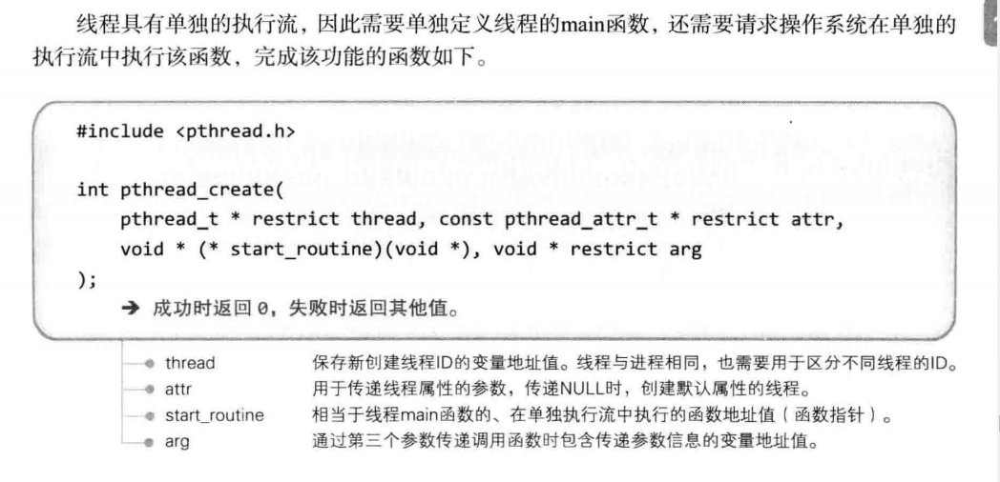
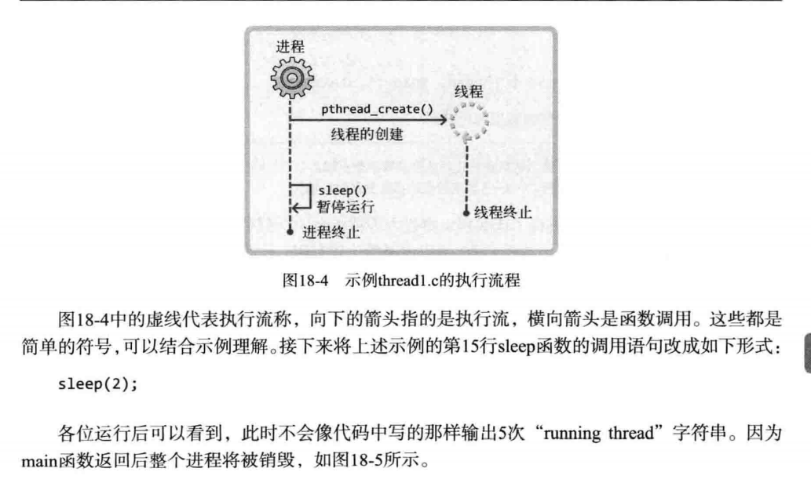

# 多线程服务端

## 为什么引入线程

（1）每个进程都拥有独立的内存空间，使得进程通信的难度提高

（2）创建进程本身的大开销

（3）会用到上下文切换


线程的创建和上下文切换比进程快

线程间交换数据时无需特殊技术


## 线程的创建和执行流程



````c++
#include<pthread.h>
#include<unistd.h>
#include<stdio.h>
#include<stdlib.h>

void * thread_main(void* arg){
    int cnt = *((int*)arg);
    for(int i = 0;i<cnt;i++){
        sleep(1);
        puts("running thread\n");
    }
    return NULL;
}

int main()
{
    pthread_t id;
    int thread_param = 5;
    pthread_create(&id,NULL,thread_main,(void*)&thread_param);//请求创建一个线程，并从传入的函数调用开始，在单独的执行流中运行
    sleep(10);
    puts("end of main");

    return 0;
}
````

